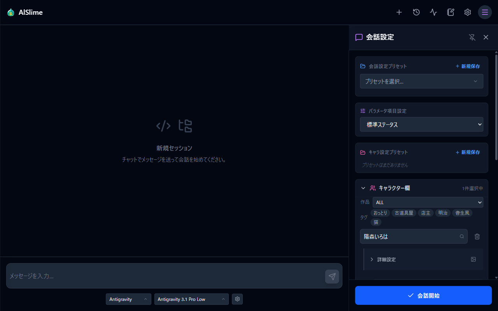

# AlSlime

**キャラクターと世界を育て、好きなAIと会話するためのローカルアプリ**

[English](README.en.md) · [日本語マニュアル](docs/manual/index.md) · [English Manual](docs/manual/en/index.md) · [GitHub Sponsors](https://github.com/sponsors/Yaki-Mikan)

AlSlimeは、自作したキャラクターとの会話を楽しむためのAI CLIフロントエンドです。キャラクターだけでなく、世界観、舞台、シチュエーション、文体、会話内の時間まで組み合わせ、ひとつの世界として会話を続けられます。

利用者が導入・認証したGemini CLI、Claude Code、Antigravityを、ブラウザの会話画面から利用します。会話履歴と設定は手元のPCへ保存されます。


*会話から生成した画像を背景にした画面です。画像生成はGitHub Sponsors支援者向けのComfyUI連携機能です。*

## AlSlimeでできること

### キャラクターと世界を育てる

キャラクターの性格、外見、服装、口調、背景を設定し、最大5人まで同じ会話へ登場させられます。世界観、舞台、シチュエーション、ユーザー設定、文体も組み合わせられるため、同じキャラクターでも異なる物語を楽しめます。

会話中は、キャラクターの状態や関係性を確認できます。会話内の日付と時刻を固定したり、メッセージを送るたびに時間を進めたりすることもできます。



### 好きなAIを会話相手にする

Gemini CLI、Claude Code、Antigravityに対応しています。各CLIで済ませた認証を利用し、会話するキャラクターや用途に合わせてAIとモデルを選べます。

会話はセッションとして自動保存されます。過去の会話を開き、続きから再開できます。お気に入りのキャラクターや世界観の組み合わせは、会話設定プリセットとして残しておけます。

### データを手元に残す

AlSlimeのサーバーは利用者のPCで動作します。キャラクター、世界観、舞台などの設定はMarkdownファイルとして管理でき、テキストエディタからも編集できます。

設定はパックとして書き出し、控えとして保管したり、別のPCへ移したりできます。会話履歴や設定ファイルは、起動フォルダ内の `roleplay/` に保存されます。

### 会話の一場面を画像にする

GitHub Sponsors支援者向けのComfyUI連携では、AIが会話の流れを読み、キャラクターや場面に合う画像を生成します。完成した画像はメッセージへ添えて残せるほか、会話画面の背景としても楽しめます。

この機能には、ComfyUI本体、画像生成モデル、対応するGPU環境が別途必要です。詳しくは[ComfyUI連携マニュアル](docs/manual/ja/09-comfyui.md)をご覧ください。

### 会話を声で聴く

GitHub Sponsors支援者向けのIrodori-TTS連携では、キャラクターの返答をAI音声合成で読み上げます。参照音声から作った声や、言葉で設計した声をキャラクターごとに割り当てられ、絵文字による感情表現にも対応しています。

この機能には、Irodori-TTS-Serverの構築とGPU環境が別途必要です。読み上げられるのは日本語のみです。詳しくは[音声読み上げマニュアル](docs/manual/ja/10-tts.md)をご覧ください。

## 主な機能

| 分類 | 内容 |
| --- | --- |
| キャラクター | 簡単設定での作成、Markdown編集、キャラクター画像と表情、複数キャラクター |
| ロールプレイ | 世界観、舞台、シチュエーション、ユーザー、文体、日時、状態と関係性 |
| 会話 | AI CLIとモデルの選択、セッション履歴、再生成、会話設定プリセット |
| データ管理 | 設定ファイルエディタ、設定パック、バックアップと移動 |
| 画像生成 | ComfyUI連携、会話からの画像生成、メッセージへの保存、背景表示 |
| 音声読み上げ | Irodori-TTS連携、キャラクターごとの声の割り当て、絵文字による感情表現（日本語のみ） |
| 表示言語 | 日本語・英語のUIと操作マニュアル |

## 動作環境

- **OS**: Windows / Linux
- **ブラウザ**: Chrome、Edge、Firefoxなどのモダンブラウザ
- **AI CLI**: 次のいずれかひとつが導入・認証済みであること
  - Antigravity
  - Gemini CLI
  - Claude Code
- **年齢**: 18歳以上

18歳以上という年齢要件は、成人向けコンテンツを目的としたものではありません。接続先の外部AIが不正確または不適切な内容を出力する可能性があり、その内容や利用者が受ける影響を開発者が管理・保証できないことを踏まえた予防的措置です。

各AI CLIの利用には、提供元との契約が別途必要な場合があります。契約や料金は変更されることがあるため、各提供元の最新情報をご確認ください。現在の対応関係は[導入とセットアップ](docs/manual/ja/01-setup.md)でご案内しています。

## クイックスタート

### 配布版

[GitHub Releases](https://github.com/Yaki-Mikan/alslime/releases) から、お使いのOS向けのファイルをダウンロードして展開します。**すべての機能を含むのは配布版です。**

- **Windows**: `alslime-X.Y.Z-windows-amd64.zip` を展開し、`alslime.exe` をダブルクリックで起動します
- **Linux**: `alslime-X.Y.Z-linux-amd64.tar.gz` を展開（`tar xzf alslime-X.Y.Z-linux-amd64.tar.gz`）し、`./alslime` で起動します（実行権限は付与済みです）

### ソースからビルドする

ソースからのビルドには、AIとの会話実行など中核機能の実装が含まれません（該当機能は未対応エラーになります）。UIやコードの確認・改変用としてご利用いただき、フル機能は配布版をお使いください。

ビルド済みフロントエンドが同梱されているため、Goだけでビルドできます。Go 1.26以降をご用意ください。

```sh
go build -tags purepublic -o alslime ./cmd/app
```

起動するとローカルサーバーが立ち上がります。

```sh
./alslime
# http://127.0.0.1:3000 をブラウザで開く
```

初回起動時に利用規約をご確認いただき、設定画面から使用するAI CLIを選びます。詳しい手順は[操作マニュアル](docs/manual/index.md)をご覧ください。

### UIを変更してビルドする

```sh
cd frontend
npm ci
npm run build -- --outDir "../internal/frontend/dist"
cd ..
go build -tags purepublic -o alslime ./cmd/app
```

## 操作マニュアル

マニュアルはAlSlimeの設定画面から開けるほか、GitHubでもご覧いただけます。

- [日本語マニュアル](docs/manual/index.md)
- [English Manual](docs/manual/en/index.md)

導入、最初の会話、キャラクター作成、ロールプレイ設定、設定パック、支援者機能、ComfyUI連携、音声読み上げ、トラブルシューティングをご案内しています。

## GitHub Sponsors

AlSlimeは無料で利用できます。[GitHub Sponsors](https://github.com/sponsors/Yaki-Mikan)では、開発を継続するためのご支援を受け付けています。

支援者向け機能と利用方法は、[支援者機能マニュアル](docs/manual/ja/08-sponsor.md)でご案内しています。

## データとプライバシー

AlSlimeは、会話履歴、生成物、キャラクター設定を利用者のPCへ保存します。これらを開発者へ送信する仕組みはありません。

AIへ応答を依頼する際は、選択したAI CLIを通じて、その提供元のAIサービスへ会話内容が送信されます。支援者機能を利用する場合は、GitHubアカウント識別子と支援状態が認証サーバーで扱われます。

## ライセンスと利用規約

本リポジトリは **source-available** です。OSI定義のオープンソースではありません。

- [PolyForm Noncommercial License 1.0.0](LICENSE.md)
  - 非商用目的での閲覧、利用、改変、再配布が認められています
  - ライセンスとRequired Noticeの引き継ぎが必要です
  - 商用利用は認められていません
- [AlSlime利用規約](EULA.md)
  - 18歳以上の方のみ利用できます
  - 外部AIサービスの規約は、利用者ご自身で遵守する必要があります
  - 本ソフトウェアは無保証で提供されます
- [第三者ライセンス表記](THIRD-PARTY-NOTICES.md)

> Required Notice: Copyright (c) YakiMikan

## Issueとコントリビュート

バグ報告やご要望は[Issue](https://github.com/Yaki-Mikan/alslime/issues)でお知らせください。現在、Pull Requestは受け付けていません。

## 免責

本ソフトウェアは現状有姿（AS IS）で提供され、いかなる保証もありません。AIの出力は、利用者が接続した外部AIサービスによって生成されます。詳しくは[AlSlime利用規約](EULA.md)をご確認ください。
