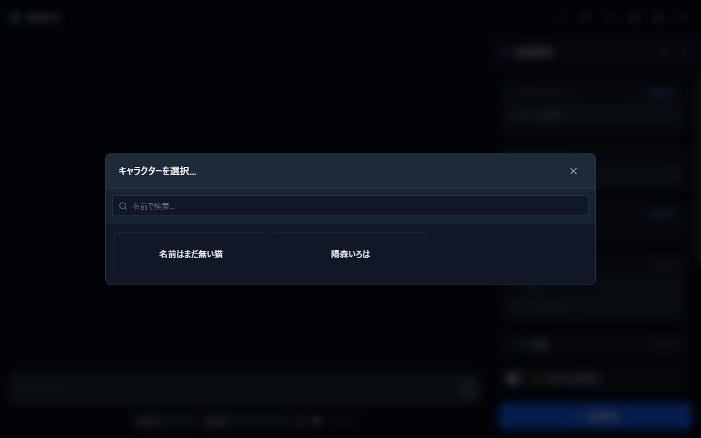
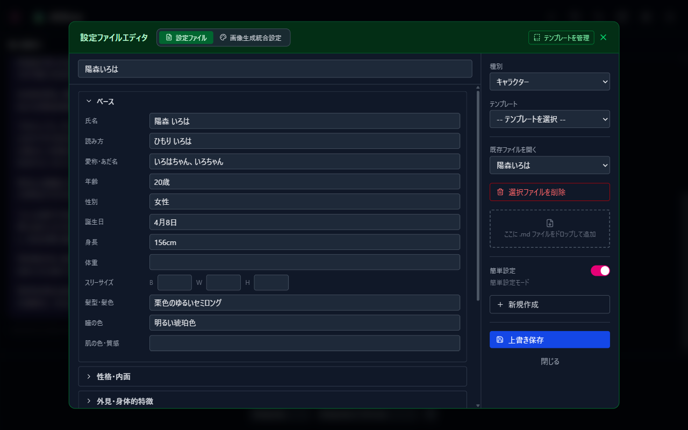
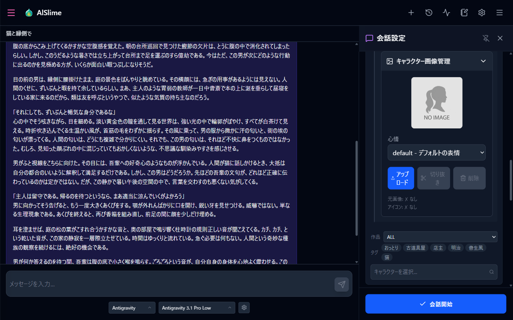
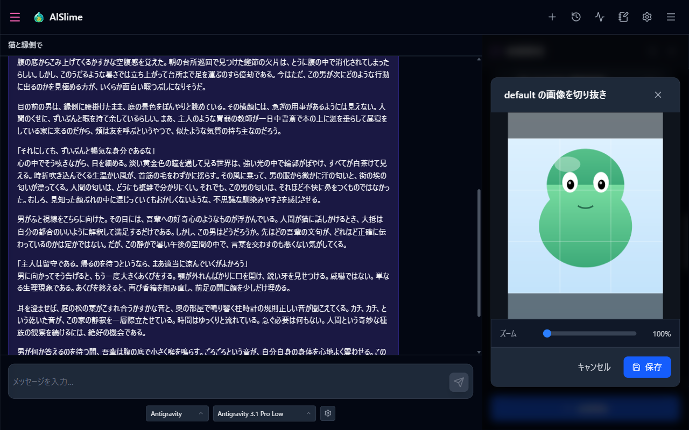
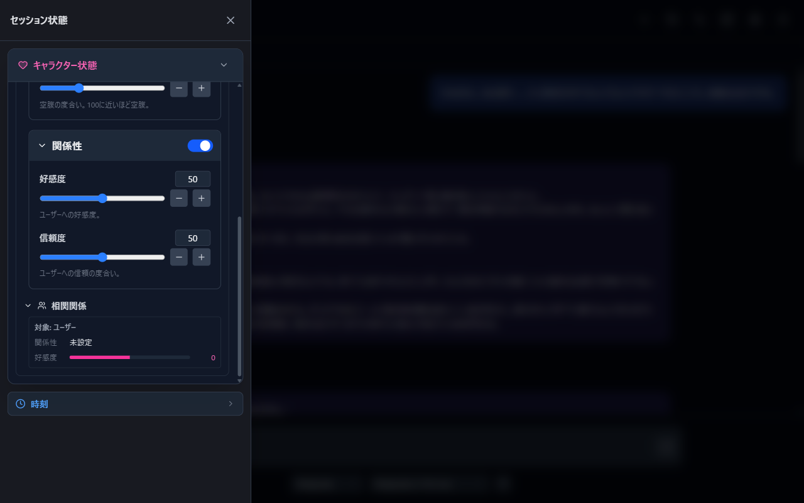

# 03 Talking with Characters

[Back to Contents](index.md)

This chapter explains how to pick a character and start a conversation, and how to create your own characters and set their images.

## What This Chapter Covers

1. Pick a character and start a conversation
2. Create your own character (Simple settings)
3. Set character images
4. View character status during a conversation

## 1. Picking a Character and Starting a Conversation

1. Press the three-line button (Conversation settings) at the right end of the header to open the right sidebar.

   

2. In the "Characters" section, press "Select character..." to open the character list.

   

   - You can narrow the list with the "Search by name..." field (type and wait one second, or press Enter, to run the search).
   - You can also narrow it with the "Work" and "Tags" filters in the Characters section of the sidebar (open the list while filtered and the filters carry over). The filter choices can be rebuilt with "Update character tag master" in Settings.
   - Choosing a character fills the slot, and an empty slot is added below it. You can select **up to 5 characters** at the same time. The trash button on a slot removes that slot.

3. To set the world, stage, situation, and so on, use the "Environment" section (see [04 Roleplay Settings](04-roleplay.md) for details).
4. Press "**Start conversation**" at the bottom to begin a new conversation with the chosen settings. After that, just send messages ([02 Your First Chat](02-first-chat.md)).

> **"Start conversation" vs. "Apply to current session"**
>
> - **Start conversation**: Starts a **new session** with the current settings.
> - **Apply to current session**: Appears when you change settings partway through a conversation. Instead of creating a new session, it **applies the changes to the conversation in progress**.

## 2. Creating Your Own Character (Simple Settings)

You can create a character just by filling in a form.

1. Open the note icon (Configuration file editor) in the header.
2. Choose "Character" as the type and switch the "**Simple settings**" toggle ON.

   

3. Fill in "Base" (name, reading, nickname, age, gender, birthday, height, and so on).
4. As needed, open the collapsible sections (Personality and inner life / Appearance and physical features / Clothing and accessories / Speech style / Background / Abilities, skills, and routines / Relationships / Other) and add details.
5. When you save, the form content is stored as a character settings file (Markdown) and the character appears in the character list.

Once you are comfortable, you can switch to "Standard settings mode" and write the Markdown directly (the Simple settings content is converted to Markdown).

To have AI create settings from a character name and work title, see [06 Auto-generating Settings](06-config-generation.md).

## 3. Setting Character Images

Registering images for a character displays them as icons next to messages during a conversation. You can register a separate image for each emotion (expression), and the expression that matches the state of the conversation is shown.

1. In the conversation settings sidebar, open "Details" for the character.
2. Open the "**Character image management**" panel.

   

3. Choose the expression to register in the "Emotion" dropdown.
4. Choose an image file with "Upload".
   - Supported formats: JPEG / PNG / WebP
   - Size limit: 5MB
5. After the upload, a cropping screen opens right away. Drag to adjust the position, use the slider to adjust the zoom (1x to 3x), then save. **Icons are cropped as squares (1:1).**

   

6. For a registered image, "Crop" in the same panel redoes the crop, and "Delete" removes it.

### Editing everything in the Config File Editor

When you open an existing file of the "Character" category in the Config File Editor, the window switches to three columns, and the character's extra settings appear as tabs in the middle.

| Tab | What it does |
| --- | --- |
| Expressions | Same as the image management panel above. Drop an image onto the preview to register it as the source image, and click the preview to open the crop screen |
| Image generation | Same items as "Character image generation settings" in the integrated image generation settings (shown only when the sponsor feature is enabled and the image generation module is connected) |
| Voice | Same items as the character assignment in TTS settings (shown only when the sponsor feature is enabled and the TTS module is connected) |
| Linked settings | Link individual personality / outfit & hair / background files to this character. When you pick the character in chat settings, the linked files are added to its individual settings automatically (already-selected files are not duplicated). You can also keep "character-side additional settings", combined with the preset's additional settings by **append** (use both) or **replace** (use only the character side) |

At the bottom of the right column there is a "Tags" area where you register the work and tags used by the chat settings filters. The character tag list is refreshed as soon as you save.

- The middle tabs and the tag area become available after the character file itself has been saved once (the save folder must exist).
- Each middle tab saves independently. A tab with unsaved changes shows a marker.
- A character with a `default` expression image is shown as a card with that image in the character picker of the chat settings.

### Creating expression images with image generation (sponsor feature)

When the image generation module is connected, the expression image area shows a "Generate expression image" button. It opens the expression image generation screen:

1. On the left, pick the target character and expression. You can keep several prompts per expression (give it a title and press "Save prompt"; the trash icon deletes one).
2. On the right, choose a workflow, set the count, and press "Generate". The generated images are listed.
3. Click an image to select it and press "Use selected image as expression image". It is registered as the source image for that expression, and the crop screen opens right away.
4. Crop and save; the result becomes the icon for that expression.

- The expression prompt goes into `{{EMOTION}}` in the workflow. If the workflow has no `{{EMOTION}}`, it is appended to the end of `{{EXTRA_POSITIVE}}`.
- "Generate" is disabled while the character image generation settings have unsaved changes. Save them first.
- Generated images are discarded when the screen is closed. Only the one you applied as the expression image remains.

## 4. Viewing Character Status During a Conversation

During a conversation, the button at the left end of the header (Session status) opens the left drawer.



- **Character status**: View each character's individual settings (personality, outfit, background), and view and edit their parameters and relationships (relation, favorability, details). Apply your edits to the conversation with "Apply to current session".
- **Session time**: Check the date and time state within the conversation ([04 Roleplay Settings](04-roleplay.md)).

## 5. Character File Layout (for manual management)

Character data is stored in `roleplay/characters/` in the startup folder, one folder per character.

```text
roleplay/characters/<character name>/
├── settings/
│   ├── <character name>.md    … character settings (Markdown)
│   ├── tags.json              … work and tags (edited in the editor's tag area)
│   └── linked_settings.json   … linked settings (linked files and character-side additional settings)
├── personalities/ , outfits_hair/ , backgrounds/ … individual settings only for this character (Markdown)
└── images/
    ├── originals/   … source images per emotion
    └── icons/       … cropped icons (default.png becomes the character card)
```

You can edit the settings Markdown directly in a text editor, or copy the whole folder as a backup.

---

Previous: [02 Your First Chat](02-first-chat.md) | Next: [04 Roleplay Settings](04-roleplay.md)

[Back to Contents](index.md)
