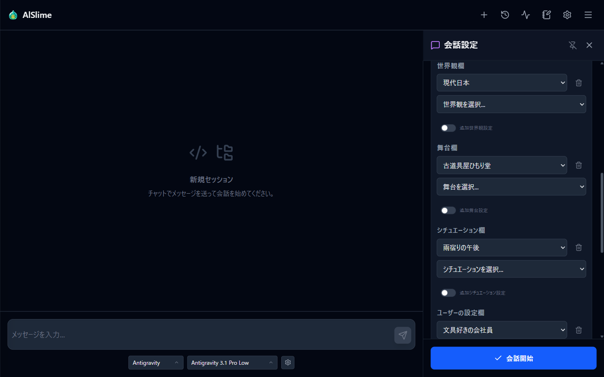
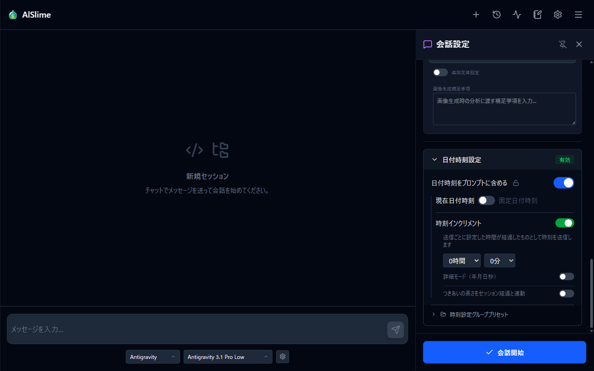
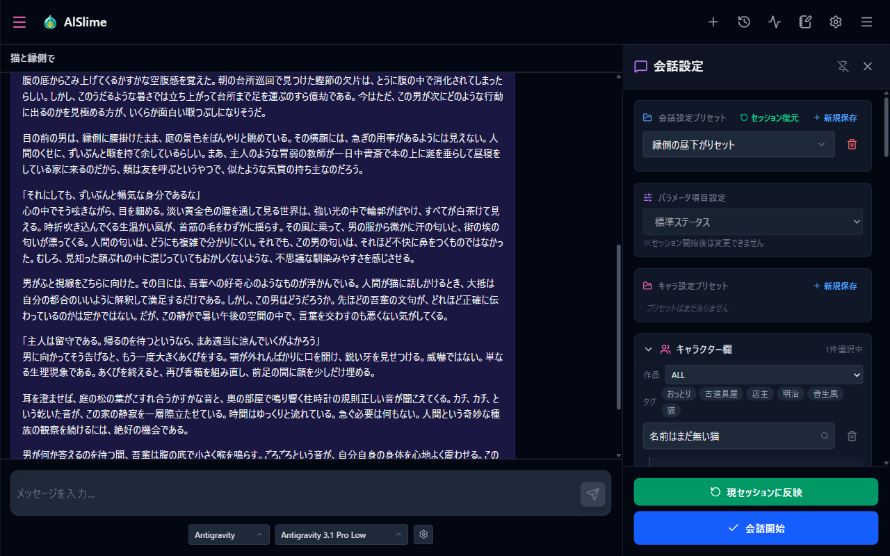
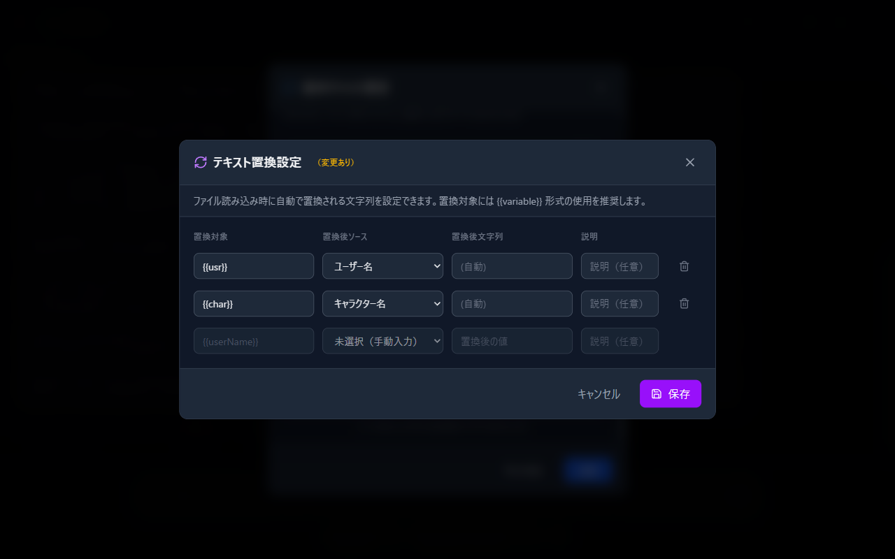
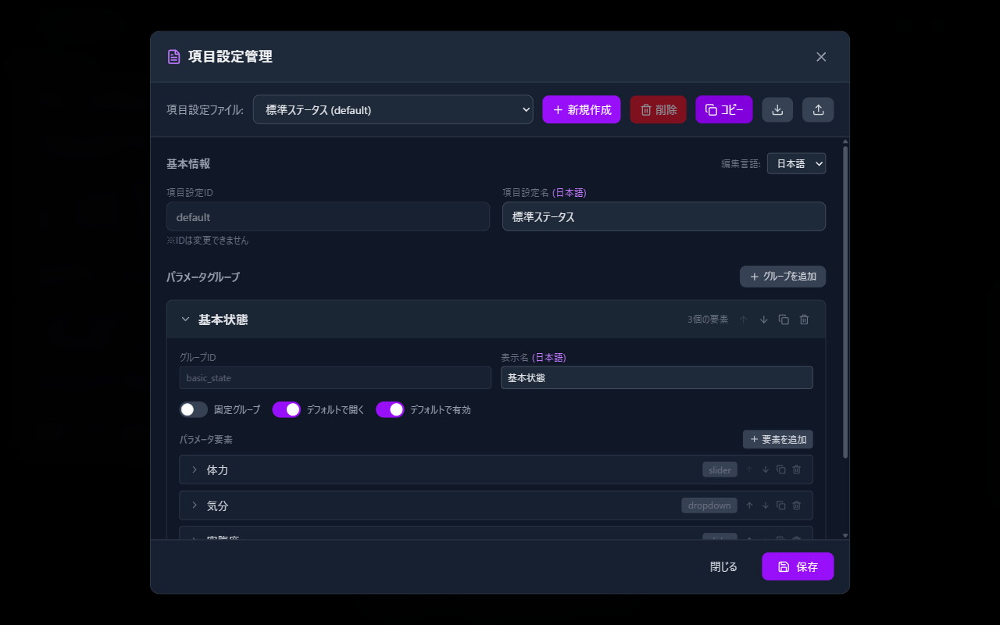
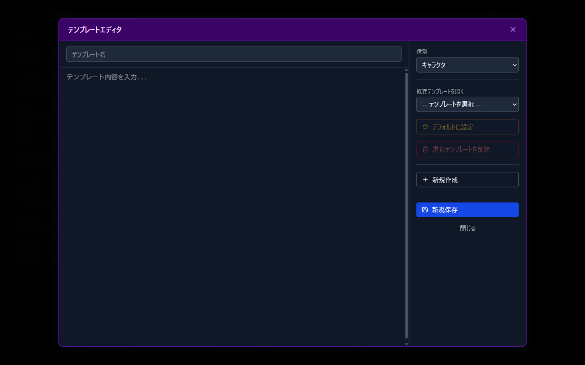

# 04 Roleplay Settings

This chapter covers the roleplay settings other than characters — worlds, stages, situations, date and time, presets, and advanced settings such as text replacement and parameter fields.

For the basics of selecting characters and starting a conversation, see [03 Talking with Characters](03-character.md) first.

## What This Chapter Covers

1. Configure the environment (world, stage, situation, user)
2. Use the writing style and overall additional settings
3. Control in-conversation time with the date and time settings
4. Save and load whole sets of settings with presets
5. Advanced settings (text replacement, parameter fields, templates)

## 1. Configuring the Environment

Open the "Environment" section in the conversation settings sidebar (the three-line button at the right end of the header). From top to bottom it contains the "World", "Stage", "Situation", and "User settings" fields.

- Each field is a dropdown. Choosing one adds an empty slot, and **each field can stack up to 5 entries**. The trash button on a slot removes it.
- Switching ON the "Additional ... settings" toggle below each field reveals a free-text box where you can supplement the chosen settings file with extra content. This is handy for one-off settings that do not warrant a file of their own.

The choices in each field are the Markdown files in the following locations in the startup folder (files organized into subfolders are shown as "folder name/file name").

| Field | Folder |
| --- | --- |
| World | `roleplay/global/worldviews/` |
| Stage | `roleplay/global/stages/` |
| Situation | `roleplay/global/situations/` |
| User settings | `roleplay/users/` |

## 2. Writing Style and Overall Additional Settings

- **Writing style**: Choose the writing style for responses (files in `roleplay/global/writing_styles/`). "Additional writing style settings" also accepts free-text notes.
- **Image-generation notes**: If you use the image generation feature ([08 ComfyUI Integration](08-comfyui.md)), write notes here to pass to the analysis at generation time.
- **Overall additional settings**: A free-text settings slot that belongs to no category. Switch the toggle ON and write in it, and the content is treated as instructions for the conversation as a whole.

## 3. Date and Time Settings

You can manage "what time it is" inside the conversation. Configure this in the "Date & time settings" section of the sidebar; when enabled, an "Enabled" badge appears on the heading.

- **Include date and time in the prompt**: This toggle is the master switch. Lock it with the lock icon next to it, and it stays enabled from the next startup onward.
- **Current date and time / Fixed date and time**: Choose between using the actual current time and fixing it at a specified date and time (year, month, day, hour, minute). The fixed side also has a "Use today's date" toggle.
- **Time increment**: Advances the in-conversation clock with each message you send, as if the configured amount of time had passed. "Detailed mode (year/month/day/second)" gives you finer steps, and "Link relationship length to session progress" advances the length of your relationship with the characters along with it.
- **Session time info**: In conversations with the increment enabled, the current session time and the cumulative elapsed days are shown, and the pencil icon lets you edit them directly. During a conversation, the same information panel (Session time) also appears inside the "Session status" drawer at the left end of the header.

There are two kinds of date and time presets. A **date & time preset** saves only the fixed date and time value, while a **time settings group preset** saves and restores the date and time plus the increment settings as a whole.

## 4. Saving and Loading Sets of Settings with Presets

The sidebar has three kinds of presets at different levels.

| Preset | What it saves | Location |
| --- | --- | --- |
| Conversation preset | The whole set of sidebar settings (characters, environment, writing style, date and time, and so on) | Top of the sidebar |
| Character preset | The character combination | Below the Characters section |
| Detail preset | The detailed settings of one character | Inside each character's Details |

The one you will use most is the **conversation preset**. Save it under a name with "New save", and you can start a conversation with the same configuration anytime from "Select preset...". When you hit on a favorite combination, save it.

## 5. Advanced Settings

### Text replacement settings

Automatically replaces specific strings when settings files are loaded. The recommended use is to write variables such as `{{usr}}` in your settings files and have them replaced with the actual names. By default, two rules are registered: `{{usr}}` (→ user name) and `{{char}}` (→ character name).

- How to open: Settings (gear) → "Basic chat settings" → "Text replacement settings"
- In each row, set "Replacement target", "Replacement source" (Not selected (manual input) / User name / Character name), and "Replacement string".

### Managing character parameter fields

You can customize the very structure of a character's internal parameters (the items shown in the [status panel in Chapter 03](03-character.md)).

- How to open: Settings (gear) → "Basic chat settings" → "Manage character parameter fields"
- On the "Parameter schema editor" screen, combine groups and elements (sliders, dropdowns, text, toggles, and so on) into a parameter schema file.
- Apply a schema you created to a conversation with the "**Parameter schema**" dropdown in the conversation settings sidebar (it cannot be changed after the session starts).

### Managing templates

You can edit the boilerplate (templates) used when creating new files in the configuration file editor.

- How to open: Configuration file editor (the note icon in the header) → "Manage templates"
- Create and edit templates per type; the one you "Set as default" becomes the initial content for newly created files.

---

Previous: [03 Talking with Characters](03-character.md) | Next: [05 Settings Reference](05-settings.md)
