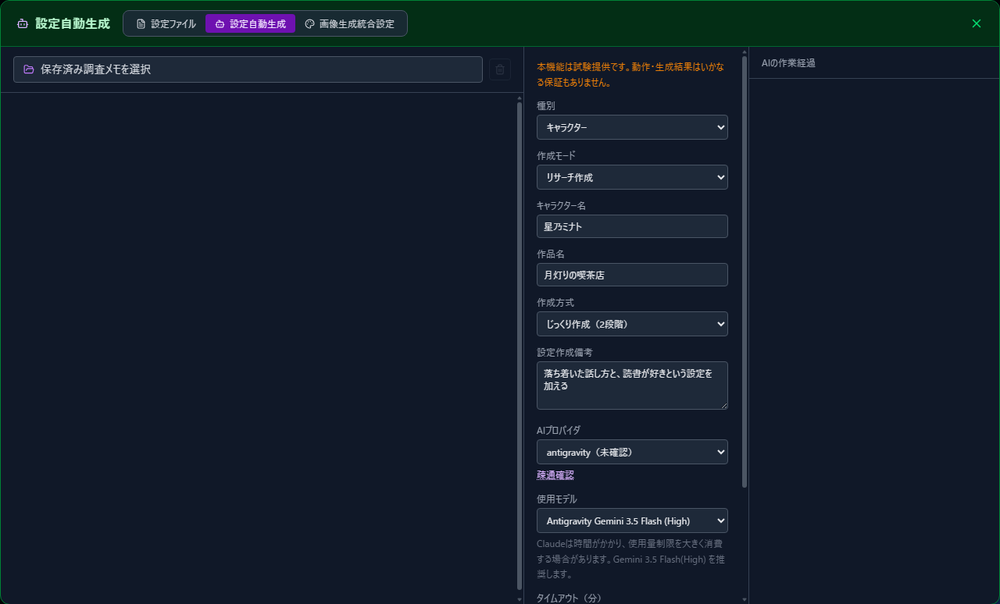

# 06 Auto-generating Settings

[Back to Contents](index.md)

AI can create character settings from a character name and work title. This feature currently supports character settings.

## 1. Open Auto-generate

1. Select the note icon in the header.
2. Open "Auto-generate" at the top of the screen.

## 2. Enter What You Want to Create

1. Make sure "Character" is selected under "Category."
2. Enter the "Character name" and "Work title."
3. If you have anything to add, enter it under "Generation notes."
4. Select the AI provider and model you want to use.

## 3. Choose a Generation Method

- **Careful (2 steps)**: Review the AI's research memo before creating the settings. Choose this method when you want to adjust the content between steps.
- **One-shot**: Runs the research and settings creation in sequence. Choose this method when you do not need to review the research memo first.

For "Careful (2 steps)," begin with "Run step 1 (research)." After reviewing the research memo, continue with "Run step 2 (create settings)."

For "One-shot," switch the generation method and select "Run."

While the AI is working, you can follow its progress under "AI progress" on the right. Generation continues even if you close the screen.

## 4. Review the Completed Settings

When generation finishes, select "Edit the settings file." Review the content and make any changes you would like before using it in a conversation.

> **Auto-generation is currently an experimental feature.**
>
> AI-generated content may contain errors or settings that differ from what you intended. Always review it before using it in a conversation.
>
> An Antigravity Flash model completed generation in about two minutes in one confirmed example. Claude may take tens of minutes and can consume a large share of your usage limits. The time required varies with the requested content and your environment.

---

Previous: [05 Settings Reference](05-settings.md) | Next: [07 Importing & Exporting Settings](07-settings-pack.md)

[Back to Contents](index.md)
