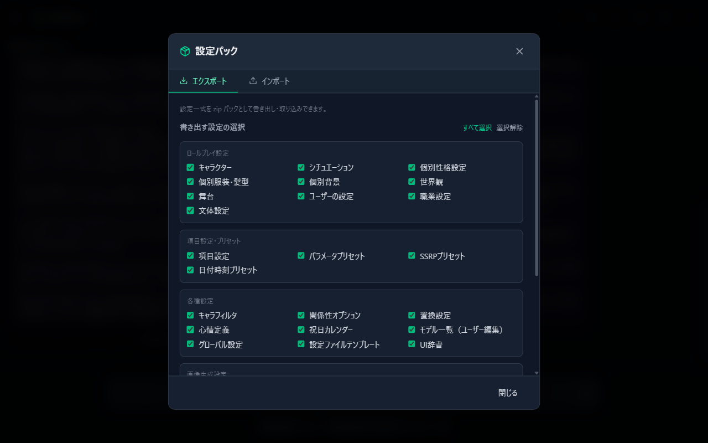
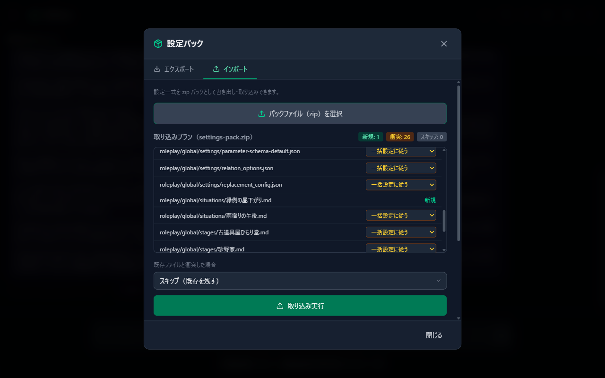

# 06 Importing & Exporting Settings

You can export your carefully crafted settings as a zip "settings pack" and import them again later. This is useful for backups, moving to another PC, and distributing or sharing settings.

How to open: Settings (gear) → "Settings pack". There are two tabs: "Export" and "Import".

## 1. Export

1. Select the kinds of settings to export. They are listed by group (everything is selected initially).
   - **Roleplay settings**: Characters, situations, worlds, stages, and so on
   - **Field settings & presets**: Parameter field settings and the various presets
   - **Miscellaneous settings**: Replacement settings, emotion definitions, the model list (user edits), and so on
   - **Image generation settings**: Tag directives, profiles, and so on (only when supporter features are active)
2. When including characters, you can also choose "Include character images" (this increases the size).
3. Enter a "Pack name (optional)" and press "Export (download zip)"; the zip is downloaded by your browser.

> **What is never included**: Credentials, conversation history, caches, logs, and environment-specific settings such as ports and connection URLs are always excluded for safety.

## 2. Import

1. Choose a settings pack with "Select a pack file (zip)".
2. The contents are inspected automatically and an "Import plan" is shown. Each file is color-coded as "New", "Conflict", or "Skip".
3. If there are conflicts with existing files, choose how to handle them.
   - **Skip (keep existing)** (default) / **Overwrite** / **Add with a new name**
   - Besides the bulk setting, you can also specify the policy individually for each conflicting file.
4. Press "Import" to apply the pack; the number of written and skipped files and the destination are shown.

Packs containing credentials cannot be imported (they are blocked automatically).

## 3. Downloading the Official Samples

From "Official samples" on the Import tab, you can download the official sample set (characters, templates, presets) from GitHub and import it directly. **Existing files are never modified** (new files only).

If you are just getting started and nothing appears in the character selection described in [Chapter 03](03-character.md), pressing this button to install the samples is the quickest way forward.

## 4. Automatic Import at Startup (import_inbox)

There is also a way to import without touching the UI. Place pack zips in `roleplay/import_inbox/` inside the startup folder and launch AlSlime; they are imported automatically.

- **Only new files** are imported. Existing files are never modified.
- Processed zips are moved to `roleplay/import_inbox/processed/` (deleted automatically after 30 days).
- Up to 10 packs are processed per startup. Any beyond that are processed at the next startup.
- The results of this startup's import can be checked under "Startup import (import_inbox)" at the bottom of the settings pack Import tab.

---

Previous: [05 Settings Reference](05-settings.md) | Next: [07 Supporter Features](07-sponsor.md)
