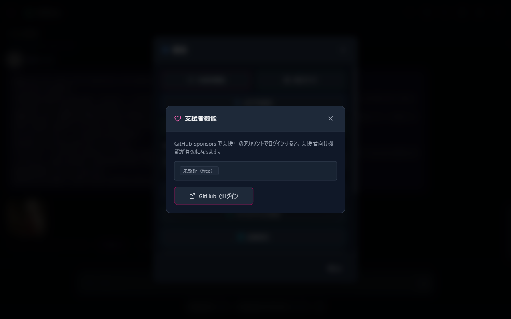
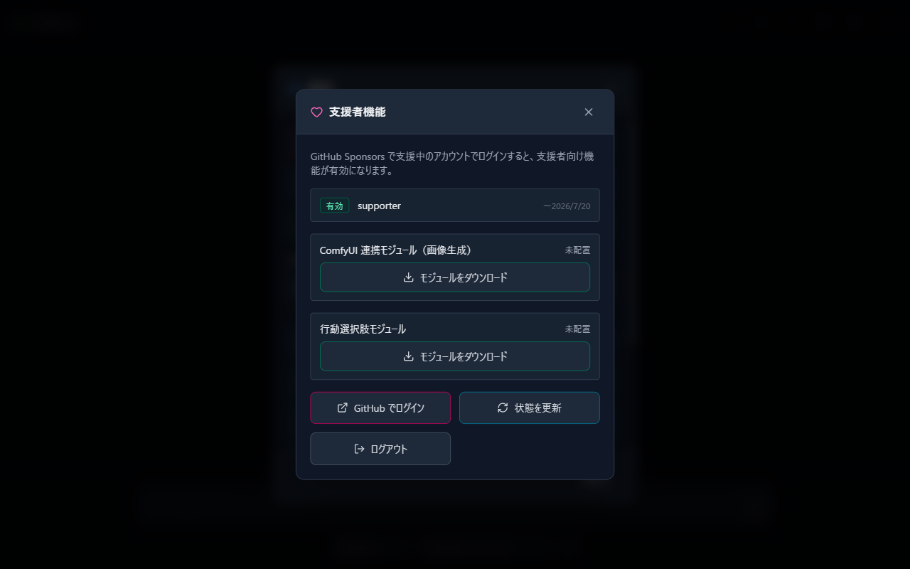

# 07 Supporter Features

AlSlime is free to use. Additional features (such as ComfyUI integration for image generation) are unlocked for those who support development through GitHub Sponsors.

## 1. The Supporter Features Screen

How to open: Settings (gear) → "Supporter features".

Your current sponsorship status is shown as a badge at the top.

| Badge | Meaning |
| --- | --- |
| Not signed in (free) | You are not signed in. Free features only |
| Active | Sponsorship has been confirmed and supporter features are available |
| Renewal pending (grace period) | Waiting for the sponsorship status to be reconfirmed. **Features remain available during the grace period** |
| Expired | The entitlement has expired. Sign in again or resume your sponsorship |
| Invalid token | There is a problem with the credentials. Please sign in again |

The sponsorship plan name and expiration date are shown next to the badge.

## 2. Signing In

1. Press "Sign in with GitHub"; the GitHub authorization page opens in your browser.
2. Authorize with an account that has an active sponsorship on GitHub Sponsors, and the app picks it up automatically (complete the browser steps while the screen shows "Complete the sign-in in your browser...").
3. If the page does not open automatically, use the "Open manually" link.

After signing in, "Refresh status" rechecks your sponsorship status, and "Sign out" clears the credentials. The signed-in state is normally maintained automatically, so you usually do not need to sign in again.

## 3. Receiving the Modules

Once your sponsorship is active, you can download the modules that contain the additional features.

- **ComfyUI integration module (image generation)**: Image generation from conversations ([08 ComfyUI Integration](08-comfyui.md))
- **Action choice module**: Presents action choices along with responses

Press "Download module" to fetch and install it; the status changes to "Installed (takes effect after restart)". **Restart AlSlime to activate it**, and the status changes to "Active (sidecar running)".

For the action choice module, the "Enable action choices (applies without restart)" toggle that appears after installation lets you switch the feature on and off without restarting.

## 4. When Things Go Wrong

- "No active sponsorship found": Check that the account you signed in with has an active sponsorship on GitHub Sponsors.
- "Token verification failed": Update the app to the latest version and try again.
- Module download fails: Check your network connection and try again.
- For anything else, see [09 Troubleshooting](09-troubleshooting.md).

---

Previous: [06 Importing & Exporting Settings](06-settings-pack.md) | Next: [08 ComfyUI Integration](08-comfyui.md)
