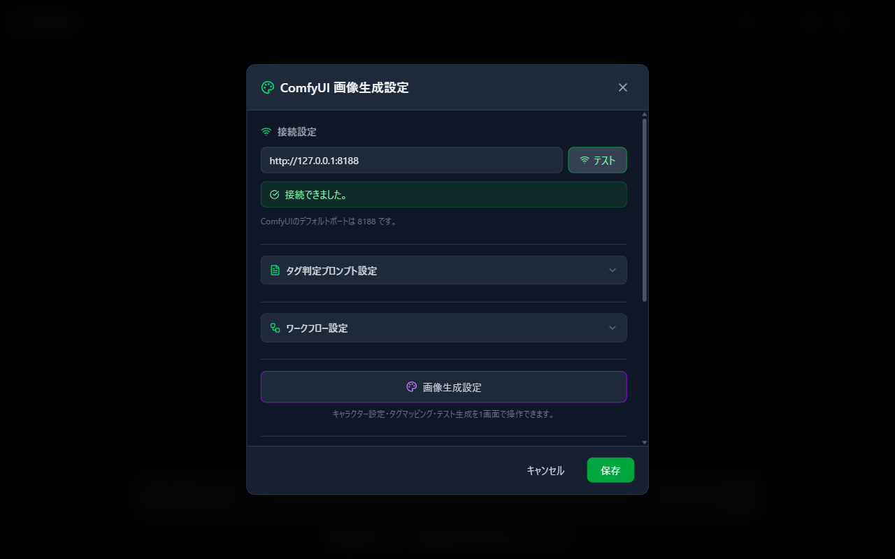
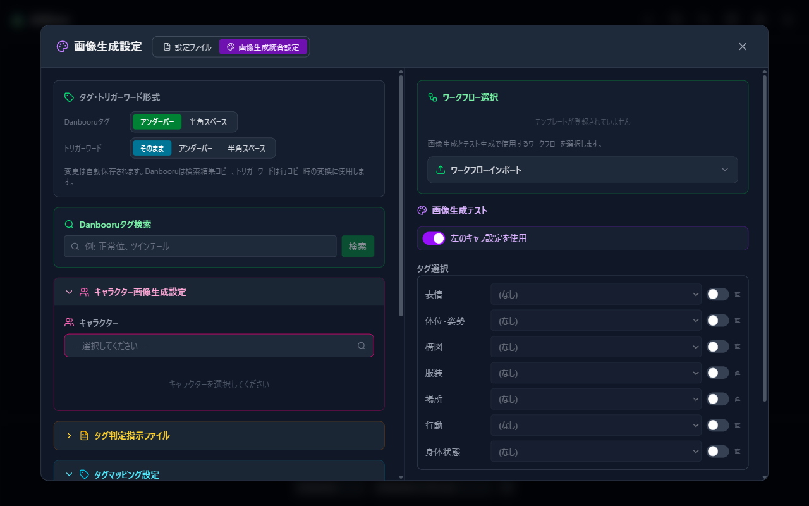
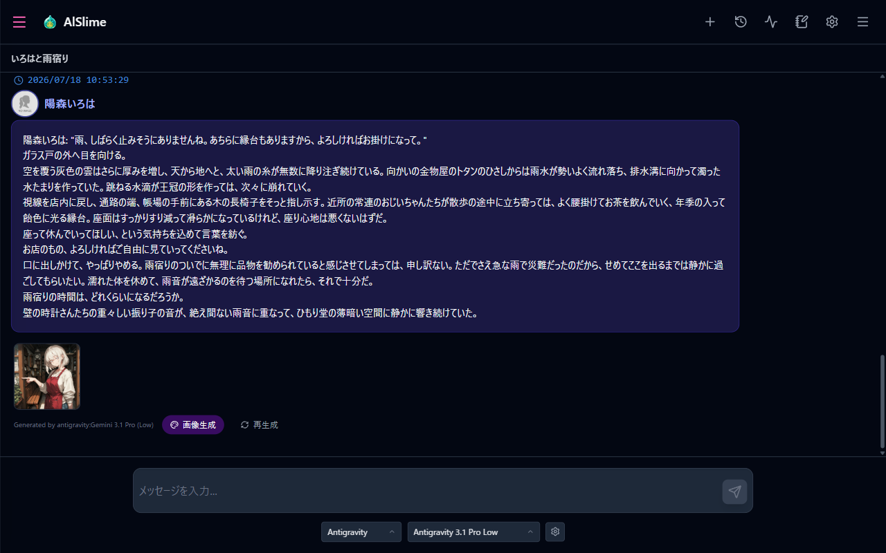
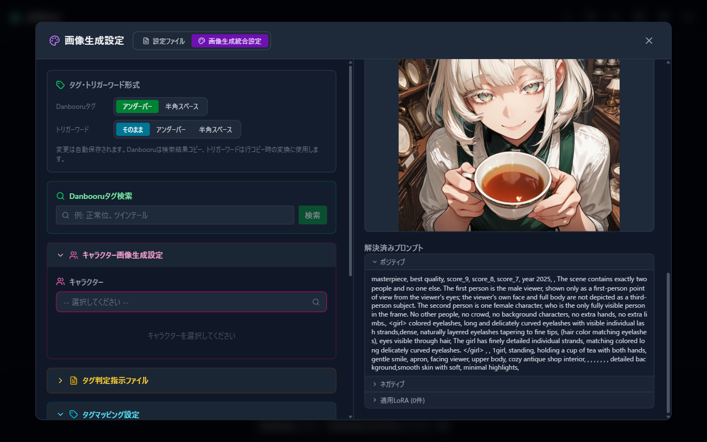

# 08 ComfyUI Integration (Image Generation, for Supporters)

This supporter feature has the AI analyze the content of your conversation and generate an image of the scene it reads with ComfyUI.

> **This feature is currently in preparation.** Please wait a little longer for its release. The contents of this chapter will become available once the feature is released.

## Prerequisites

- **Supporter features are active** (signed in via [07 Supporter Features](07-sponsor.md), with the ComfyUI integration module installed and the app restarted)
- **ComfyUI itself** is installed in your environment and running (follow the official ComfyUI instructions to install it)

## 1. Connecting to ComfyUI

How to open: Settings (gear) → "Image generation settings" (shown only when supporter features are active).

1. Enter the ComfyUI URL under "Connection settings" (default: `http://127.0.0.1:8188`. ComfyUI's default port is 8188).
2. Press "Test"; if "Connection succeeded." appears, the connection is complete.

## 2. Getting Ready to Generate

Besides the connection, generation becomes possible once the following three pieces are in place.

1. **Workflow**: Under "Workflow settings", register a JSON file saved with ComfyUI's "Save (API Format)" by drag and drop, and select it as the template to use (UI-format JSON files cannot be registered).
2. **Tag judge AI**: Under "Tag judge prompt settings", choose the AI (Gemini / Claude / Antigravity) and model that judges image generation tags from the conversation.
3. **Generation profile and tag directive file**: These two **work as a set**. You can create your own, but importing the ones included in the [official samples from Chapter 06](06-settings-pack.md) is the quickest route.

## 3. Per-Character Image Generation Settings

Register a character's appearance as tags and LoRA so that generated images look like that character.

- How to open: the image icon on the character frame in the conversation settings sidebar ("Open image-generation settings for this character"), or "Character image generation settings" inside the image generation settings.
- Main settings: character name and work name, Danbooru tag search, character prompt, physical features, LoRA (strength and trigger words), outfit settings (when the AI returns an outfit name, the matching prompt and LoRA are applied), and extra positive / negative prompts.

On wide screens, an **integrated settings** view opens where you can edit all of these in one place (it can also be opened from the "Image generation settings" tab of the configuration file editor). You edit the settings on the left while checking the results with test generation on the right.

## 4. Generating Images from a Conversation

1. During a conversation, an "**Image generation**" button appears on AI response messages.
2. Press it, and the tag judge AI reads the scene from the flow of the conversation and generation starts in ComfyUI (the button changes to "Generating...").
3. The generated image is attached to that message. Click it to enlarge, and from the enlarged view you can also choose "Set this image as background".

## 5. Test Generation

When you want to try generation without a conversation, use "Image generation test". Specify a template, character, tags, and placeholders, press "Generate", and check the result together with the "Resolved prompt" (the positive / negative prompts and LoRA actually used). This is handy for tuning your settings.

## 6. Session Background Image

This feature shows the image from an image-bearing response as the screen background while that response is visible. The settings are at the **very bottom of the image generation settings**. You can adjust the opacity, the scaling (fill screen / show entire image), and the display area (history area only / include chat area).

## When Things Go Wrong

- "Connection test failed": Check that ComfyUI itself is running and that the URL and port are correct.
- "This file is in UI format": Save the file again from ComfyUI using "Save (API Format)".
- "Timeout (5 minutes)": Generation on the ComfyUI side may be taking too long. Check the status in the ComfyUI interface itself.
- For anything else, see [09 Troubleshooting](09-troubleshooting.md).

---

Previous: [07 Supporter Features](07-sponsor.md) | Next: [09 Troubleshooting](09-troubleshooting.md)
