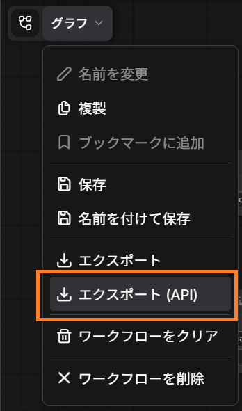

# Preparing a Custom Workflow

You can use your usual ComfyUI workflow for image generation in AlSlime.

This guide explains how to add placeholders to a workflow and register it with AlSlime. You do not need these steps when using the official "AlSlime Generic Workflow" as provided.

## Check the Workflow in ComfyUI

First, open the workflow in ComfyUI and make sure it can generate an image normally.

The models, LoRA, and custom nodes used by the workflow must be installed in ComfyUI.

## Add Placeholders

A custom workflow can also reflect the characters and scenes read from your conversation.

Open the workflow in ComfyUI and add the following text to the positive prompt used for image generation:

```text
__CHARACTER__, __FEATURES__, __OUTFIT__, __EMOTION__, __POSE__, __COMPOSITION__, __ACTION__, __BODYSTATE__, __LOCATION__, __RATING__, __QUALITY_EXTRA__, __EXTRA_POSITIVE__
```

Add the following text to the negative prompt:

```text
__EXTRA_NEGATIVE__, __TAG_NEGATIVES__
```

You can leave your usual quality, style, and other prompts in place.

## Save in API Format

Once the workflow is ready, save the JSON file that will be registered with AlSlime.

1. Open "Graph" at the top left of the ComfyUI screen.
2. Select "Export (API)".
3. Keep the JSON file downloaded by your browser.



Depending on the ComfyUI version and display language, this command may appear as "Export (API)" or "Save (API Format)".

## Register with AlSlime

1. Open Settings (gear) → "Image generation settings".
2. Open "Workflow settings".
3. Drag and drop the saved JSON file into the file area, or select the area and open the file.
4. Enter a name that will be easy to recognize, then select "Add".
5. Choose the workflow to use for image generation, then select "Save" at the bottom of the screen.

After registration, try generating one image with "Image generation test".

## Placeholder Reference

| Placeholder | Content |
| --- | --- |
| `__CHARACTER__` | Character name, work name, character prompt, and LoRA trigger words |
| `__FEATURES__` | Physical features such as hairstyle, hair color, and eye color |
| `__OUTFIT__` | Current outfit |
| `__EMOTION__` | Expression and emotion |
| `__POSE__` | Pose |
| `__COMPOSITION__` | Composition and camera direction |
| `__ACTION__` | Character action |
| `__BODYSTATE__` | Temporary physical state in the scene |
| `__LOCATION__` | Location and background |
| `__EXTRA_POSITIVE__` | "Extra positive" from the character image generation settings |
| `__EXTRA_NEGATIVE__` | "Extra negative" from the character image generation settings |
| `__TAG_NEGATIVES__` | Negative prompts from the selected tag mappings |
| `__RATING__` | Content specified by a generation profile |
| `__QUALITY_EXTRA__` | Content specified by a generation profile or placeholder preset |

You can also write a placeholder as `{{POSE}}`. This guide uses the `__POSE__` form.

## Use LoRA

For workflows that use the standard `CheckpointLoaderSimple`, or `UNETLoader` together with `CLIPLoader`, LoRA selected in AlSlime can be applied automatically.

If LoRA is not applied with a custom model-loading node, try adding the LoRA you normally use directly to the workflow.

## Use Multiple Workflows

You can register more than one workflow. Choose the one you normally use under "Workflow selection" and save the setting.

To switch workflows according to the scene, see [Image Generation Settings in Detail](09-comfyui-settings-details.md).

---

[Return to 09 ComfyUI Integration](09-comfyui.md)
