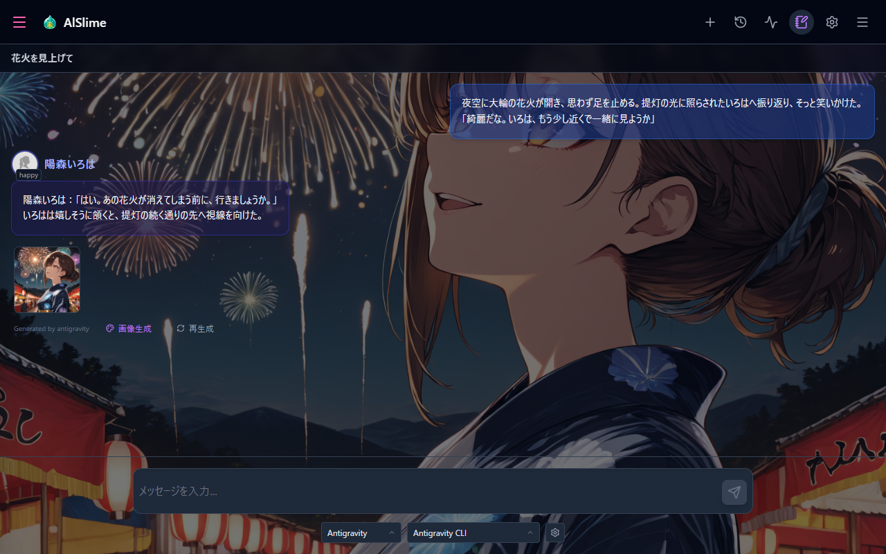
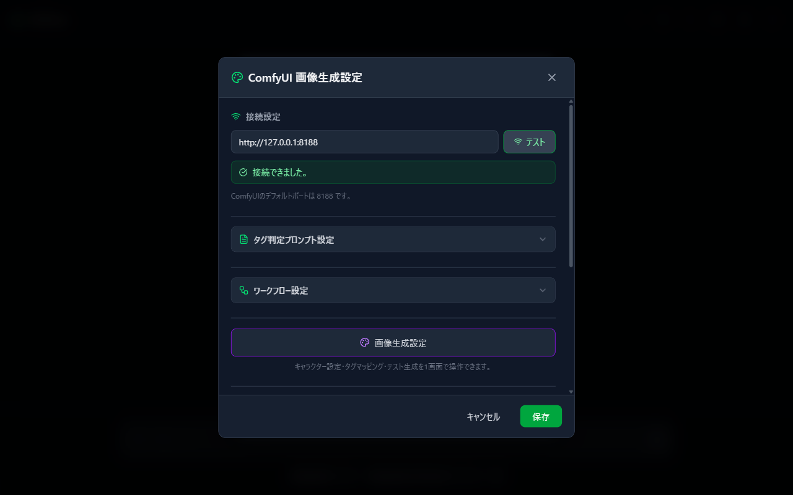
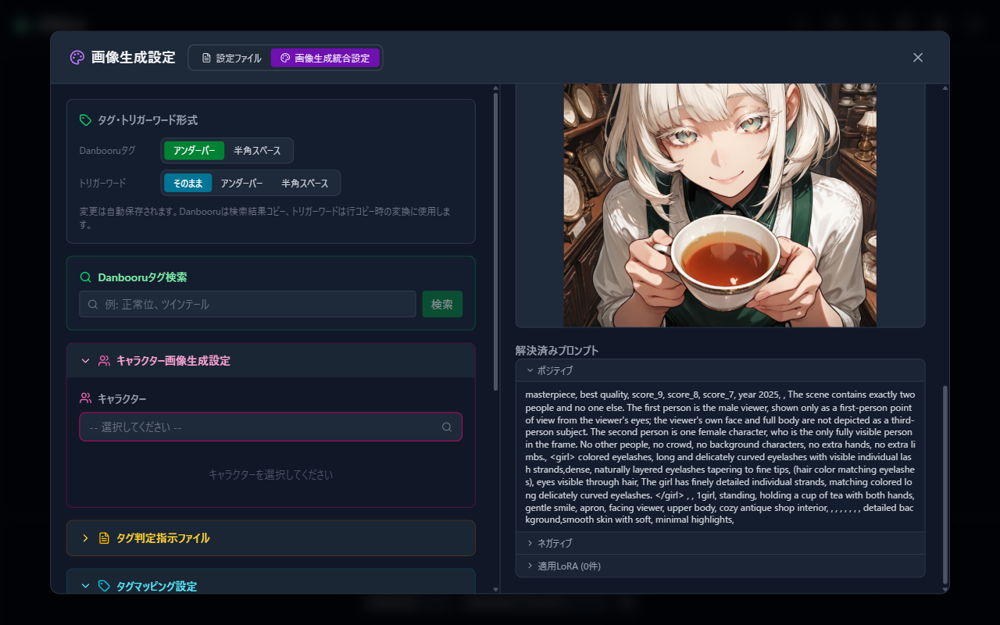
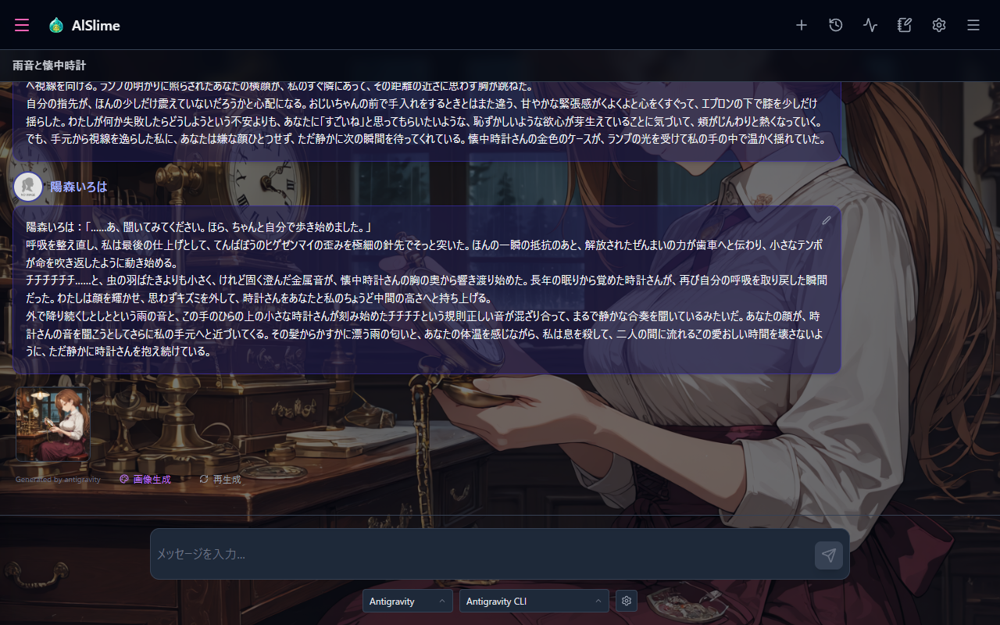
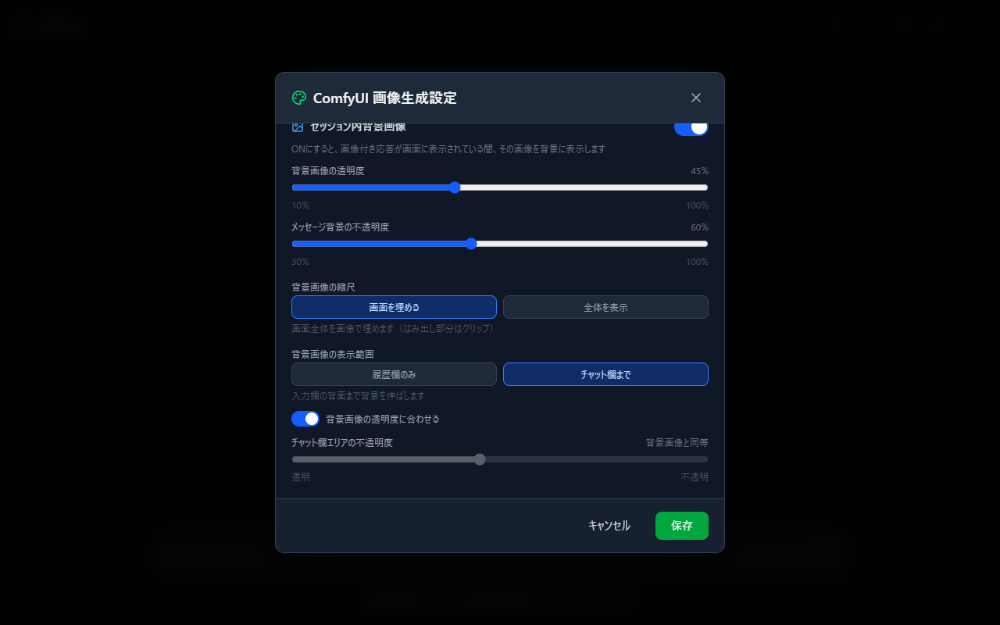
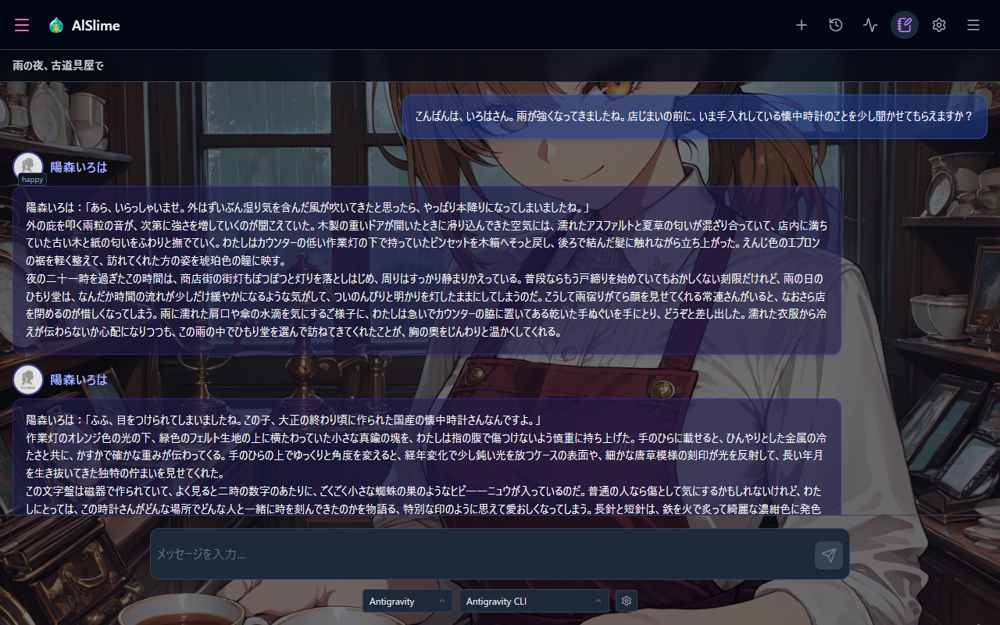

# 09 ComfyUI Integration (Image Generation, for Supporters)

[Back to Contents](index.md)

This supporter feature lets an AI read the scene in your conversation and ask ComfyUI to turn it into an image. It adds a visible moment to the time you spend with the character portrayed by the AI.

> **This feature is currently in preparation.** Please wait a little longer for its release. The features described in this chapter will become available once it is released.

## Turn a Moment from Your Conversation into a Background

AlSlime can read the current scene from the flow of a character conversation and create an image of it with ComfyUI. The finished image can remain attached to the response or become the background for that session.

The scenery becomes part of the time you have spent talking together. This chapter guides you through the preparations needed to generate images suited to your characters and scenes.

## What This Chapter Covers

1. Understanding the roles of ComfyUI and AlSlime
2. Checking the connection to ComfyUI
3. Setting up a workflow template and tag judge AI
4. Preparing character and scene settings
5. Checking the result with test generation
6. Generating an image from a conversation

## Before You Begin

ComfyUI performs the actual image generation. AlSlime asks an AI to read the conversation, prepares prompts and LoRA suited to the character and scene, and then asks ComfyUI to generate the image. AlSlime receives the finished image and displays it with the corresponding message.

Before continuing, make sure the workflow can **successfully generate an image in ComfyUI by itself**. The models, LoRA, and custom nodes required by the workflow must be installed in ComfyUI.

### Prerequisites

- You have completed [08 Supporter Features](08-sponsor.md), and the ComfyUI integration module shows "Active (sidecar running)"
- ComfyUI is installed and running in your environment
- The workflow, models, LoRA, and custom nodes you intend to use are available in ComfyUI
- The AI CLI used for tag judging is installed and authenticated

If ComfyUI is not ready yet, please refer to the official guides:

- [ComfyUI system requirements](https://docs.comfy.org/installation/system_requirements)
- [Comfy Desktop for Windows](https://docs.comfy.org/installation/desktop/windows)
- [ComfyUI Portable for Windows](https://docs.comfy.org/installation/comfyui_portable_windows)
- [Your first image generation](https://docs.comfy.org/get_started/first_generation)
- [Installing custom nodes](https://docs.comfy.org/installation/install_custom_node)

## 1. Prepare the Essentials

When using image generation for the first time, the following order will help you get started smoothly.

1. Follow [08 Supporter Features](08-sponsor.md) to download the ComfyUI integration module. Once the download finishes, the general-purpose "AlSlime Generic Workflow" is placed in AlSlime automatically, and a copy of the same workflow JSON is saved to your browser's download location.
2. Open the downloaded workflow in ComfyUI, prepare the required models, LoRA, and custom nodes, and generate one image.
3. Import the official image-generation samples from [07 Importing & Exporting Settings](07-settings-pack.md).
4. Open "Image generation settings" in AlSlime and check the connection to ComfyUI.
5. Prepare the character image generation settings.
6. Check the result with "Image generation test".
7. Return to the conversation and try "Image generation" on an AI response.

The current official samples include a tag directive file for getting started. You can first confirm that generation works with the sample as provided, then refine the settings to your liking.

## 2. Connect to ComfyUI

How to open: Settings (gear) → "Image generation settings".

"Image generation settings" appears when supporter features and the ComfyUI integration module are active.

1. Under "Connection settings", enter the URL of the running ComfyUI instance. The default is `http://127.0.0.1:8188`.
2. Select "Test" and make sure "Connection succeeded." appears.
3. Select "Save" at the bottom of the screen.

If ComfyUI is running on the same PC with its usual settings, the default URL should work. If you changed the host or port, enter the same URL used by ComfyUI.

## 3. Check the Workflow

Downloading the ComfyUI integration module automatically provides the "AlSlime Generic Workflow". A JSON copy of the same workflow is also saved to your browser's download location.

Drag and drop the saved JSON file onto the ComfyUI screen to open it. Make sure every model and custom node used by the workflow is available in ComfyUI, then prepare the workflow so that it can generate one image in ComfyUI by itself.

> **Before generating an image from AlSlime, always open the workflow in ComfyUI and check it at least once.**
>
> If even one model or custom node required by the workflow is missing, the image cannot be generated. Skipping this check and starting generation from AlSlime will cause generation to fail.

If you need another copy of the file, open "Image generation settings" → "Workflow settings", select "AlSlime Generic Workflow", and use the download icon beside it.

To use a workflow you created yourself, see [Preparing a Custom Workflow](09-comfyui-custom-workflow.md).

## 4. Choose the Tag Judge AI

Under "Image generation settings" → "Tag judge prompt settings", you can choose the AI that reads the conversation and decides what the image should contain.

1. Choose the **tag judge prompt format**.
   - **Danbooru tags only**: Suited to general workflows that primarily accept tags.
   - **Mixed natural language**: Suited to models and workflows that can also accept natural-language descriptions.
2. Under **Analysis AI**, choose Gemini CLI, Claude Code CLI, or Antigravity CLI.
3. Choose the **Analysis model**. With Claude Code CLI, you can also choose an effort level when needed.
4. Adjust the tag judge timeout only if necessary, then select "Save".

The selected AI CLI must already be installed and signed in. See [01 Installation & Setup](01-setup.md) for preparation.

The "Analysis AI" reads the conversation and organizes the scene. The model that draws the image is the model selected in the ComfyUI workflow.

For the image-generation model, Anima is recommended with "Mixed natural language", while Illustrious is recommended with "Danbooru tags only". AlSlime recommends Anima overall because it can receive the scene from a conversation through natural-language descriptions.

For more about the available formats and tag directives, see [Image Generation Settings in Detail](09-comfyui-settings-details.md).

## 5. Prepare Character Image Generation Settings

Registering the character's appearance, outfits, and LoRA helps generated images resemble the character you are speaking with.

You can open the settings in either of these ways:

- Select the image icon on the character frame in the conversation settings sidebar
- Open Settings (gear) → "Image generation settings" → "Character image generation settings"

Enter the character name, appearance, outfits, and LoRA you wish to use, then select "Save". You can leave any settings you do not need blank while trying the feature.

For guidance on individual fields and settings that change with the scene, see [Image Generation Settings in Detail](09-comfyui-settings-details.md).

## 6. Check with Test Generation

Before generating from a conversation, it is reassuring to try one image with "Image generation test".

1. Choose the workflow template to use.
2. Choose the character you want to depict.
3. Select "Generate".
4. Check the result under "Generation result".

To try another variation with the same settings, select "Regenerate".

## 7. Generate an Image from a Conversation

Once everything is ready, return to the conversation and ask ComfyUI to depict the scene.

1. Select "Image generation" on an AI response message.
2. The tag judge AI reads the conversation up to that response and prepares content suited to the scene.
3. AlSlime adds the character settings and asks ComfyUI to generate the image.
4. The completed image appears with the selected response message.

While generation is in progress, the button changes to "Generating...". Please wait for it to finish. Select the image to enlarge it, review the positive prompt, or set it as the background.

Generated images are stored with the conversation session and message, so they remain visible when you open the same session again.

## 8. Use a Generated Image as the Background

While a response with an image is displayed, you can use that image as the conversation background.

At the bottom of Settings (gear) → "Image generation settings", the "Session background image" section lets you adjust:

- Whether the background image is shown
- Image opacity
- Whether the image fills the screen or fits entirely within it
- Whether it appears only behind the history or extends into the chat area
- Input-area opacity when the background extends into the chat area

Once the display suits you, select "Save" at the bottom of the screen.

The generated image will appear behind the conversation. You can adjust the opacity while checking that the messages remain easy to read.

If a message has more than one image, open the enlarged view and select "Set this image as background" to choose the one you prefer.

## 9. Keep a Copy of Your Settings

You can export the settings you prepared as "Image generation settings" from [07 Importing & Exporting Settings](07-settings-pack.md). This provides a backup while you refine the settings or when moving them to another PC.

ComfyUI models, LoRA, and custom nodes are not included in the settings pack. Please keep a separate copy of those files on the ComfyUI side.

## When Things Go Wrong

- **"Image generation settings" is not visible**: Open [08 Supporter Features](08-sponsor.md) and make sure the ComfyUI integration module shows "Active (sidecar running)". AlSlime must be restarted after the module is installed.
- **The connection test fails**: Make sure ComfyUI is running and that the connection URL and port match ComfyUI.
- **A custom workflow cannot be registered**: See [Preparing a Custom Workflow](09-comfyui-custom-workflow.md) and check the save format and registration steps.
- **A node or model error appears**: Make sure the models, LoRA, and custom nodes used by the workflow are available in ComfyUI.
- **Tag judging does not finish**: Make sure the selected AI CLI can start on its own and is signed in.
- **Generation takes a long time**: Tag judging and ComfyUI image generation have separate waiting times. Check both the AlSlime display and the current status in ComfyUI.
- For anything else, see [11 Troubleshooting](11-troubleshooting.md).

---

Previous: [08 Supporter Features](08-sponsor.md) | Next: [10 Text-to-Speech (Irodori-TTS Integration)](10-tts.md)

[Back to Contents](index.md)
