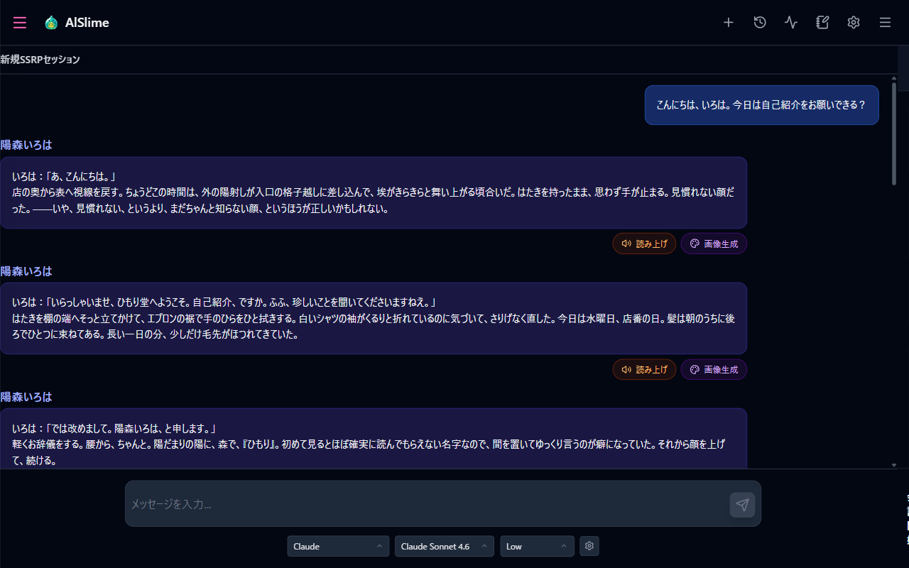
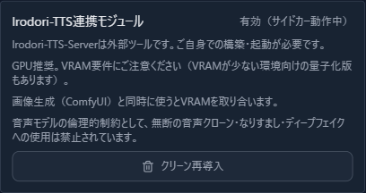
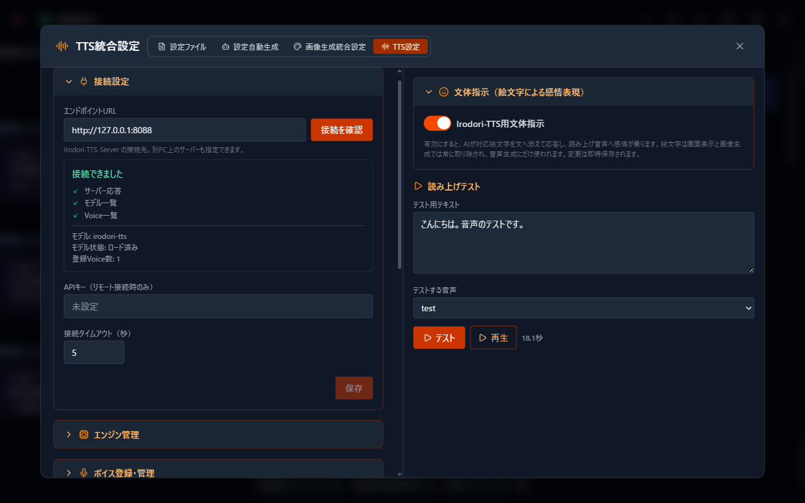
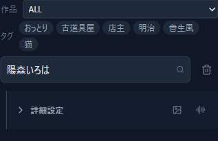
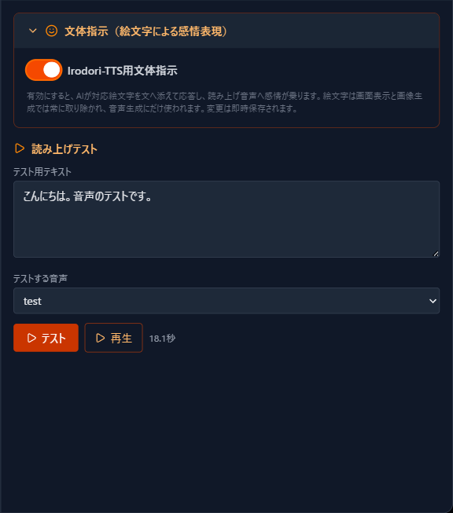
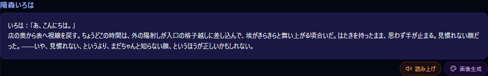
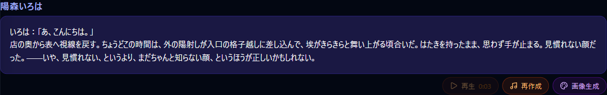
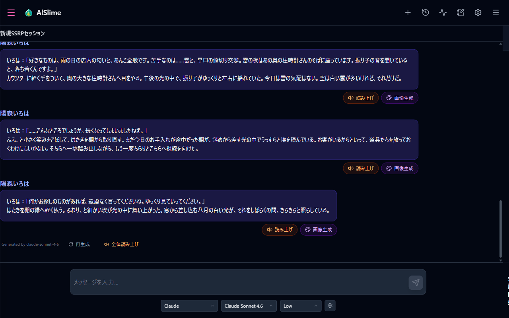
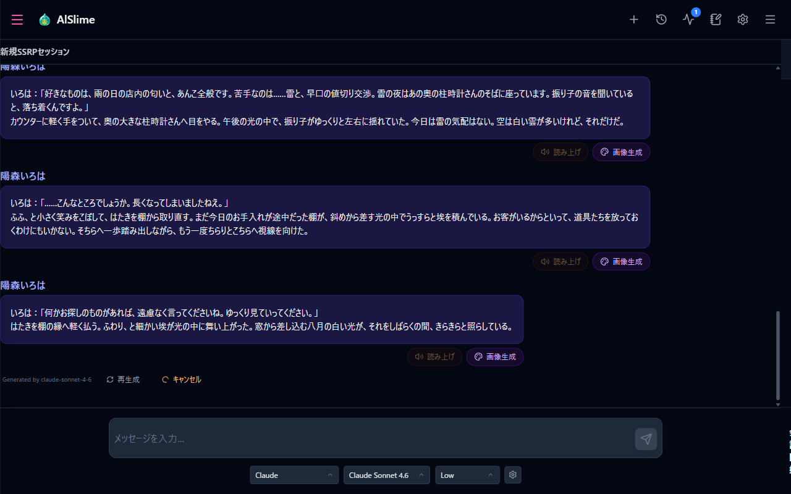
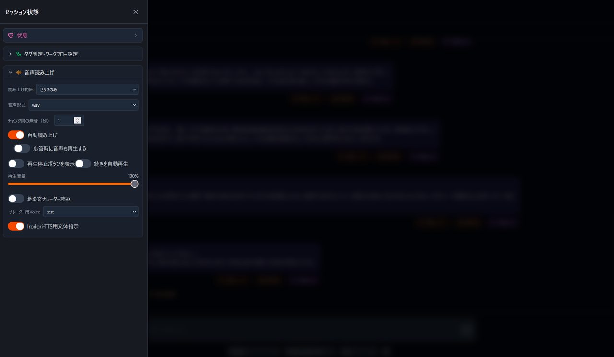

# 10 Text-to-Speech (Irodori-TTS Integration, for Supporters)

[Back to Contents](index.md)

This supporter feature has the AI speech synthesizer Irodori-TTS read your characters' replies aloud. Create a voice from reference audio, assign it to each character, and listen to your conversations.

> **Language notice**
>
> Irodori-TTS reads **Japanese text only**. In addition, the module download card and the text-to-speech panel in the left menu of the chat screen appear only while the display language is set to Japanese. To install the module, switch the display language to Japanese once (Settings → Display Language), then switch back if you prefer.

This chapter walks you through the preparation until you can listen to conversations in the voices you like.

## What This Chapter Covers

1. Understanding the roles of Irodori-TTS-Server and AlSlime
2. Setting up Irodori-TTS-Server
3. Checking the connection with AlSlime
4. Preparing voices and assigning them to characters
5. Checking with the reading test
6. Reading conversations aloud

## Introduction

The audio itself is generated by Irodori-TTS-Server. AlSlime splits each response into blocks of dialogue, asks Irodori-TTS-Server to synthesize them with the voice assigned to the character, receives the finished audio, and lets you play it from the corresponding message.

### Prerequisites

- You have completed [08 Supporter Features](08-sponsor.md) and the Irodori-TTS integration module shows as enabled (sidecar running)
- Irodori-TTS-Server is installed and running in your own environment
- A GPU is recommended. Quantized models are available for environments with less VRAM
- When used together with image generation (ComfyUI), the two compete for VRAM, so allow some headroom
- The display language is set to Japanese (required to download the module)

Before creating voices from reference audio, please also read the notice at the beginning of [Creating Voices](10-tts-voice.md).

## 1. Preparing Everything Step by Step

When using this feature for the first time, we recommend the following order.

1. Following [08 Supporter Features](08-sponsor.md), download the Irodori-TTS integration module.
2. Install Irodori-TTS-Server in your own environment and start it.
3. In AlSlime's "TTS Settings", check the connection to Irodori-TTS-Server.
4. Register a voice from reference audio.
5. Assign the voice to a character.
6. Check the result with the reading test.
7. Back in the conversation, try "Read aloud" on a response.

The module card also summarizes the notes you should read before use.

## 2. Setting Up Irodori-TTS-Server

Irodori-TTS-Server is an external tool. You build and start it in your own environment. Two servers are available.

| Choice | Description |
| --- | --- |
| AlSlime fork (recommended) | [Irodori-TTS-Server-AlSlime](https://github.com/Yaki-Mikan/Irodori-TTS-Server-AlSlime). All AlSlime features are available |
| Official version | The official Irodori-TTS-Server. Basic speech synthesis works, but the following features are unavailable |

When connected to the official version, AlSlime detects it automatically and disables the following.

- Non-ASCII voice IDs (the official version accepts ASCII letters and numbers only)
- Direct registration of latent files
- Engine management (model switching, low-memory mode, server restart)

### Installing and starting the fork

1. Open the [Irodori-TTS-Server-AlSlime page](https://github.com/Yaki-Mikan/Irodori-TTS-Server-AlSlime) and download it via "Code" → "Download ZIP".
2. Extract the downloaded ZIP to a place you like.
3. Double-click `start_irodori_server.bat` inside the extracted folder.

The first launch takes a while because the runtime environment is built and the models are downloaded automatically. From the second launch on, the build step is skipped and the server starts right away.

For GPUs other than NVIDIA or for Linux, see the repository README. When installing from the command line, choose the environment as follows.

| Environment | Command |
| --- | --- |
| NVIDIA CUDA | `uv sync --extra cu128` |
| AMD ROCm (Linux) | `uv sync --extra rocm` |
| CPU only | `uv sync --extra cpu` |

## 3. Connecting AlSlime

How to open: Config File Editor → "TTS Settings" tab. It can also be opened from Settings (gear) → "TTS settings".

"TTS Settings" appears when the supporter features and the Irodori-TTS integration module are enabled.

1. In "Connection", enter the URL of the running Irodori-TTS-Server into "Endpoint URL". The default is `http://127.0.0.1:8088`.
2. Choose "Test connection" and confirm that "Connection succeeded" is shown. Three items are checked: server response, model list, and voice list.

If Irodori-TTS-Server runs on the same PC with its default settings, the default URL works as-is. For the API key used when connecting to a server on another PC, see [Settings Reference](10-tts-settings-details.md).

## 4. Preparing Voices

There are two ways to prepare a voice.

- **From reference audio**: capture the voice quality from an audio file of yours and register it as a voice.
- **VoiceDesign**: describe the voice in words, such as "a calm, low female voice".

The steps are covered in [Creating Voices](10-tts-voice.md), together with the notice about handling reference audio.

## 5. Assigning Voices to Characters

Assign a registered voice to a character, and that character's dialogue is read in the assigned voice.

Either way of opening works:

- "TTS Settings" → "Character assignment"
- The voice settings icon in the character frame of the conversation settings sidebar

1. Choose a character under "Character".
2. Choose a voice under "Voice".
3. Choose "Save".

"Preview with this character" lets you check the assigned voice right away. For VoiceDesign captions and the other fields, see [Creating Voices](10-tts-voice.md).

## 6. Checking with the Reading Test

Before using it in conversation, it is reassuring to try a short line with the "Reading test".

1. Enter test text into "Reading test" on the right side of "TTS Settings".
2. Under "Voice to test", choose a voice or the selected character.
3. Choose "Test".
4. When generation finishes, listen with "Play".

The very first generation takes longer because Irodori-TTS-Server loads the model automatically. It becomes faster from the second time.

## 7. Reading Conversations Aloud

Once everything is ready, go back to the conversation and listen. There are two ways to start reading.

### Reading each block of dialogue

Each block of a character's dialogue (each bubble) has a "Read aloud" button.

1. Choose "Read aloud" on the block you want to hear.
2. While generating, the button changes to "Cancel". Please wait a moment.
3. When generation finishes, a "Play" button appears with the duration.

Generated blocks can be recreated with "Regenerate audio".

### Reading the whole response

Choose "Read all" at the bottom of a response to generate all its blocks in order and play them continuously.

While generating, "Read all" changes to "Cancel". During continuous playback, the per-block controls take a rest; stop the playback before operating them.

Generated audio is saved with the conversation session and message, so it can be played again when you reopen the same session. Audio you no longer need can be removed with "Delete audio" on the block.

### Reading automatically

Open the menu at the top left of the chat screen and enable "Auto read-aloud" in the "Text-to-speech" panel, and audio is generated automatically for each new response. Enable "Also play audio when a response arrives" as well, and it is played right away.

This panel also lets you adjust the reading scope, playback volume, and so on while you chat. See [Settings Reference](10-tts-settings-details.md) for the items.

## 8. Adding Emotion with Emojis

Enable "Style directive (emotion via emojis)" at the top right of "TTS Settings", and the AI adds supported emojis to its sentences so that emotion and tone are carried into the generated speech.

The emojis are used only as acting directions for the speech; they are always removed from the display and from image generation. See [Settings Reference](10-tts-settings-details.md) for the list of supported emojis and how they work.

## 9. Keeping Your Settings

The bundled files, such as the emoji description file, can be exported as "Irodori-TTS bundled files" in [07 Importing & Exporting Settings](07-settings-pack.md).

The connection settings depend on your environment and are not included in settings packs. When moving to another PC, enter the server URL again in the new environment.

## Troubleshooting

- **"TTS Settings" or the read-aloud buttons are missing**: open [08 Supporter Features](08-sponsor.md) and check that the Irodori-TTS integration module is enabled (sidecar running). Downloading the module requires the display language to be Japanese.
- **The connection test fails**: check that Irodori-TTS-Server is running and that the endpoint URL and port match the server.
- **"No voice is assigned" is shown**: the character has no assigned voice. See [5. Assigning Voices to Characters](#5-assigning-voices-to-characters).
- **Audio takes a long time**: the first generation includes loading the model. Using image generation at the same time also competes for VRAM and can slow things down.
- **mp3 fails**: an mp3 encoder (FFmpeg) is required on the Irodori-TTS-Server side.
- **Engine management is unavailable**: you are connected to the official server. Please use the fork.
- For anything else, see [11 Troubleshooting](11-troubleshooting.md).

---

Previous: [09 ComfyUI Integration](09-comfyui.md) | Next: [11 Troubleshooting](11-troubleshooting.md)

[Back to Contents](index.md)
