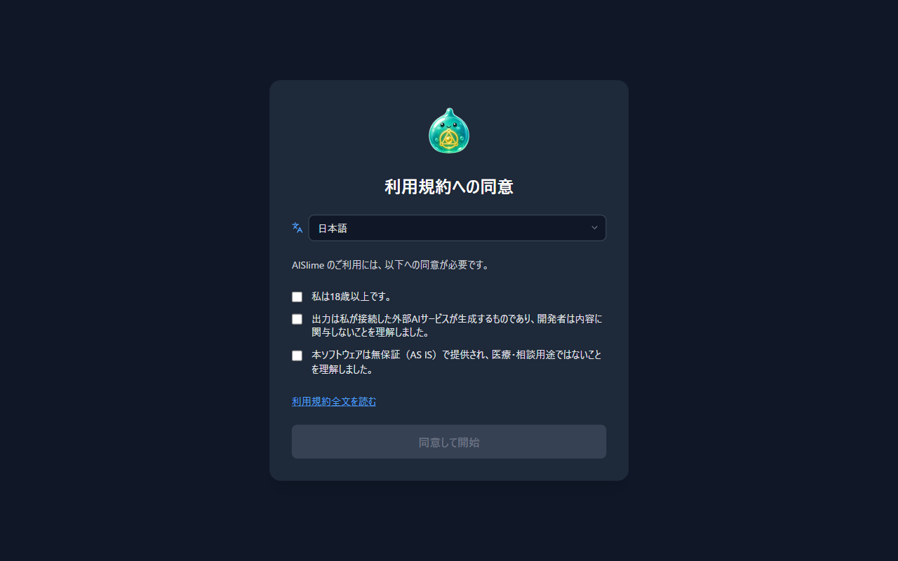
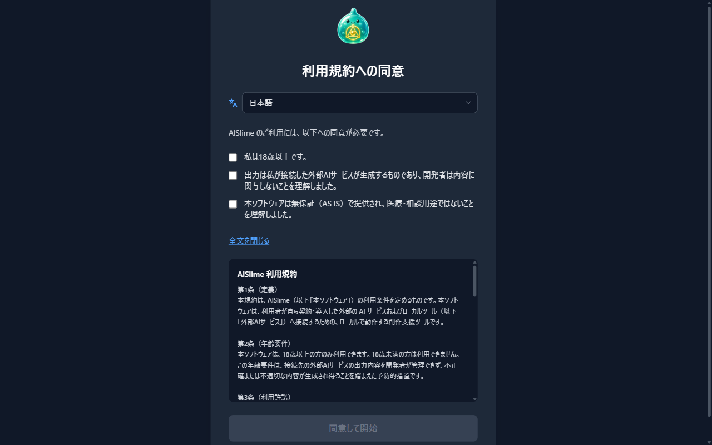
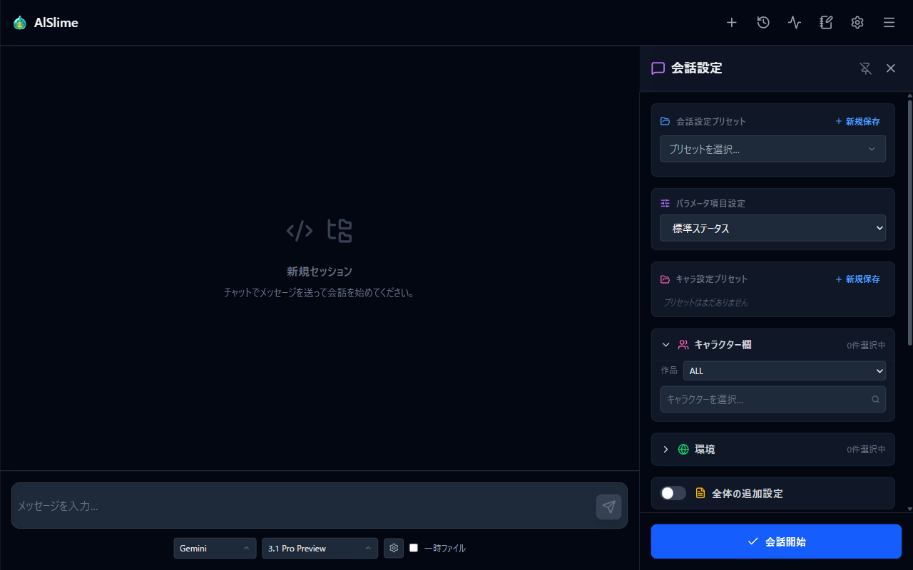
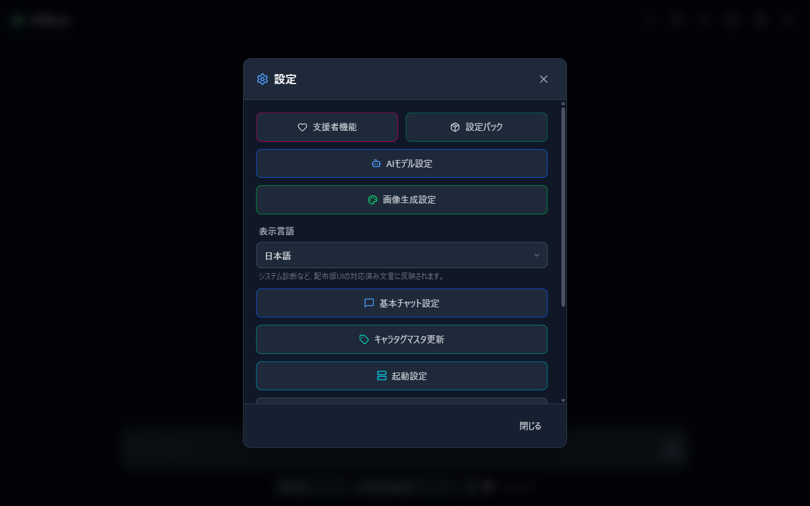
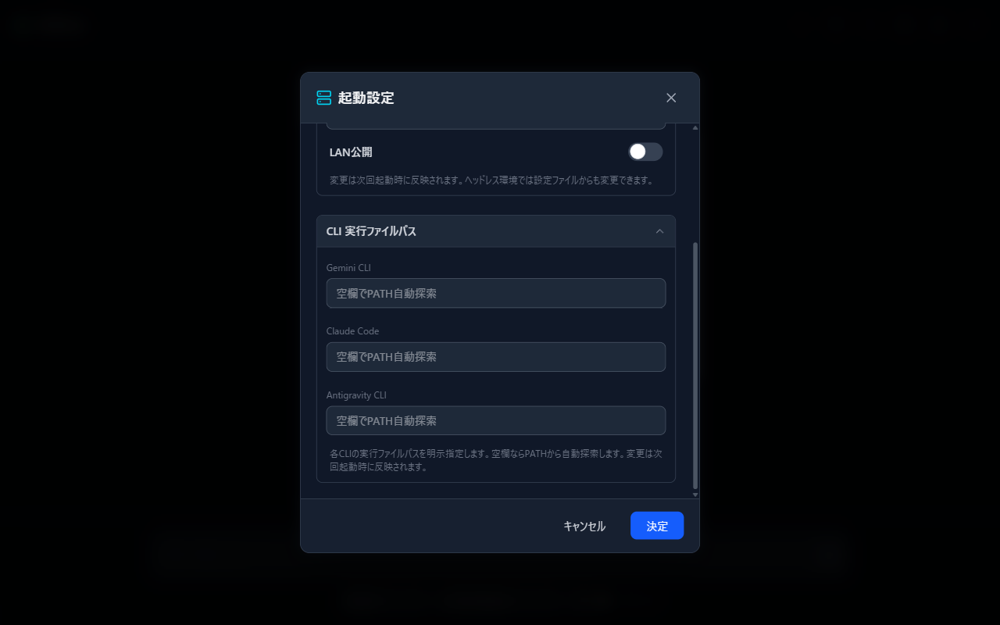

# 01 導入とセットアップ

AlSlime のインストールから、最初の画面が表示されるまでを説明します。

## この章でやること

1. 動作環境を確認する
2. AlSlime を入手する
3. 起動して、ブラウザで画面を開く
4. 利用規約に同意する
5. AI CLI との接続を確認・設定する

## 1. 動作環境

- **OS**: Windows / Linux
- **ブラウザ**: 一般的なモダンブラウザ（Chrome / Edge / Firefox など）
- **AI CLI**: 以下のいずれかが導入・認証済みであること
  - Gemini CLI
  - Claude Code
  - Antigravity CLI

AlSlime は AI CLI の「フロントエンド」です。AI CLI 本体の導入・契約・認証はそれぞれの提供元の手順に従って、あらかじめ済ませておいてください。

## 2. 入手する

### 配布版（GitHub Releases）

GitHub Releases から、お使いの OS 向けのファイルをダウンロードして展開します（配布は準備中です）。

### ソースからビルドする

Go 1.26 以降があれば、リポジトリを取得してビルドできます。ビルド済みフロントエンドが同梱されているため、Go だけで完結します。

```sh
go build -tags purepublic -o alslime ./cmd/app
```

## 3. 起動する

### 起動する場所に注意

AlSlime は、**起動したフォルダの中**に会話データや設定（`roleplay` フォルダなど）を作成します。実行ファイルは専用のフォルダに置き、そのフォルダから起動してください。

### 起動と画面の表示

実行ファイルを起動すると、手元の PC の中だけで動くローカルサーバーが立ち上がり、**普段お使いのブラウザで画面が自動的に開きます**。



初回はここで利用規約への同意画面が表示されます（次節）。

> **ブラウザが自動で開かないときは**
>
> - コンソールに表示されるアドレス（通常は `http://127.0.0.1:3000`）を、ブラウザで直接開いてください。
> - ポート 3000 を他のアプリが使用していると起動できません。その場合は本章「6. 起動の詳細設定」でポートを変更するか、他のアプリを終了してください。
> - そのほかのトラブルは [09 困ったときは](09-troubleshooting.md) を参照してください。

## 4. 利用規約に同意する

初回起動時に「利用規約への同意」画面が表示されます。

1. 画面上部のプルダウンで表示言語（日本語 / English）を切り替えられます。
2. 3つの確認項目を読み、内容に同意できる場合はチェックを入れます。
   - 私は18歳以上です。
   - 出力は私が接続した外部AIサービスが生成するものであり、開発者は内容に関与しないことを理解しました。
   - 本ソフトウェアは無保証（AS IS）で提供され、医療・相談用途ではないことを理解しました。
3. 「利用規約全文を読む」を押すと、その場で規約の全文を確認できます。

   

4. 3つすべてにチェックを入れると「同意して開始」ボタンが押せるようになります。

同意するとメイン画面が表示されます。同意の記録は手元の PC にのみ保存されます。



## 5. AI CLI との接続を確認・設定する

### まずはそのまま送信してみる

AI CLI をコマンド（`gemini` / `claude` など）としてそのまま実行できる環境（PATH が通っている状態）なら、**設定は不要です**。AlSlime が自動で実行ファイルを探します。

[02 はじめての会話](02-first-chat.md) に進んで、メッセージを送ってみてください。エラーになる場合だけ、次の手順で実行ファイルの場所を指定します。

### 実行ファイルの場所を指定する

1. メイン画面の右上にある歯車アイコン（設定）を押して、設定メニューを開きます。

   

2. 「起動設定」を押します。
3. 「CLI 実行ファイルパス」のセクションを開きます。

   

4. 使用する CLI（Gemini CLI / Claude Code / Antigravity CLI）の欄に、実行ファイルのフルパスを入力します。空欄のままにした CLI は、これまでどおり PATH から自動探索されます。
5. 「決定」を押して保存します。

## 6. 起動の詳細設定（必要な場合のみ）

設定メニューの「起動設定」では、ポートなどの起動条件も変更できます。**これらの変更は次回起動時に反映されます。**

- **ポート**: 画面を開くアドレスのポート番号（既定: 3000）
- **待受アドレス**: サーバーが待ち受けるアドレス（既定: 127.0.0.1 = 自分の PC からのみ接続可能）
- **LAN公開**: 同じネットワークの他の端末からアクセスできるようにします。信頼できるネットワーク以外では有効にしないでください。

環境変数でも指定できます（設定ファイルより優先されます）。

| 環境変数 | 内容 |
| --- | --- |
| `PORT` | 待ち受けポート番号 |
| `HOST` | 待ち受けアドレス |
| `WORKSPACE_ROOT` | データを保存するフォルダ（未設定なら起動したフォルダ） |
| `ALSLIME_NO_BROWSER` | 何か値を設定すると、起動時のブラウザ自動起動を無効にします |

---

目次: [index](../index.md) | 次章: [02 はじめての会話](02-first-chat.md)
