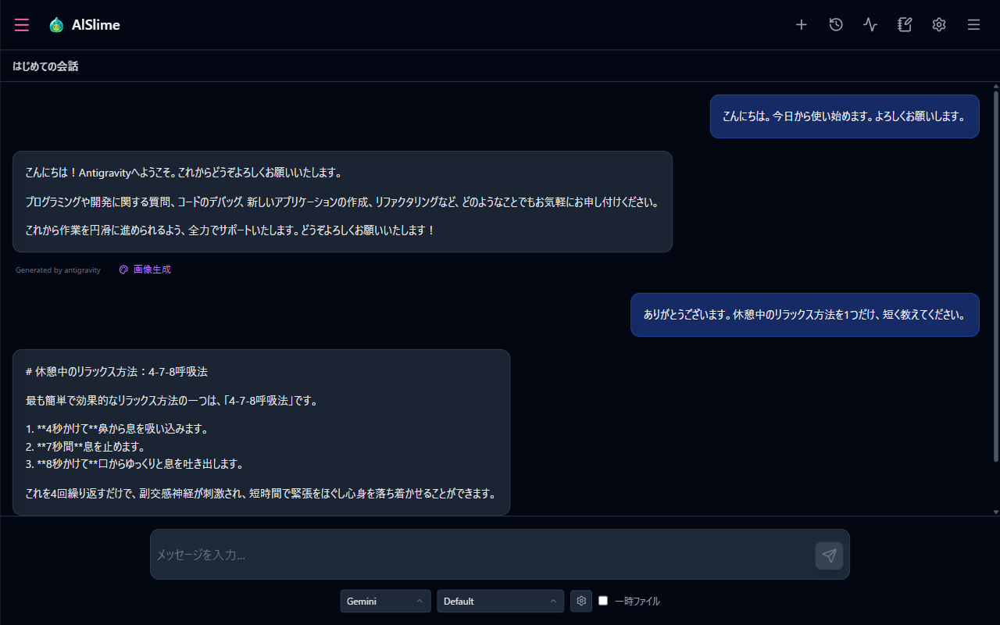
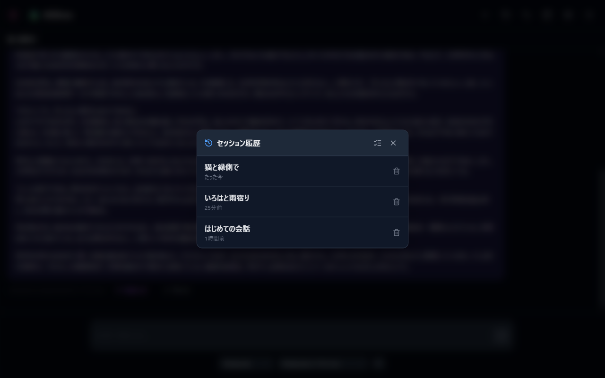

# 02 はじめての会話

メイン画面の見かたと、メッセージを送って応答を受け取るまでを説明します。

## この章でやること

1. 画面の各部分の名前と役割を知る
2. 使う AI とモデルを選ぶ
3. メッセージを送って、応答を受け取る
4. セッション（会話のまとまり）を切り替える

## 1. 画面の見かた

### ヘッダー（画面上部）

| ボタン | 名前 | 役割 |
| --- | --- | --- |
| ＋ | 新規セッション | 新しい会話を始める |
| 時計 | セッション履歴 | 過去の会話の一覧を開いて再開する |
| 波形 | ジョブ進行状況 | 実行中の処理の進み具合を見る |
| ノート | 設定ファイルエディタ | キャラクターなどの設定ファイルを編集する（04章） |
| 歯車 | 設定 | アプリ全体の設定メニューを開く（05章） |
| 三本線 | 会話設定 | ロールプレイの会話設定を開く（03・04章） |

会話中は、ヘッダー左端に「セッション状態」ボタンが加わります。画面幅が狭いときは、一部のボタンが2段目に並びます。

### そのほかの領域

- **中央**: メッセージの表示領域。会話がまだ無いときは「チャットでメッセージを送って会話を始めてください。」と表示されます。
- **下部**: メッセージ入力欄。AI とモデルの選択もここにあります。
- **右側**: 「会話設定」を押すと開くサイドバー。キャラクターや舞台などのロールプレイ設定をここで選びます。

> **初回起動時のヒント**: はじめて起動したときは、右側の「会話設定」が自動で開くことがあります。キャラクターとの会話設定は [03 キャラクターと会話する](03-character.md) で説明しますので、まずは普通のチャットを試す場合はいったん閉じてかまいません。

## 2. AI とモデルを選ぶ

入力欄の下側に、選択欄が2つ並んでいます。

1. **左の選択欄**: 使う AI（Antigravity / Claude / Gemini）を切り替えます。
2. **右の選択欄**: その AI のモデルを切り替えます。
3. その右の**歯車アイコン**（モデル設定を開く）から、既定のモデルやモデル一覧の編集ができます（詳細は [05 設定リファレンス](05-settings.md)）。

どの AI が使えるかは、[01 導入とセットアップ](01-setup.md) で確認した AI CLI の導入状況で決まります。

## 3. メッセージを送る

1. 入力欄にメッセージを書きます。
2. **Shift+Enter キーで送信**します（青い紙飛行機の「送信」ボタンでも送れます）。

   > **キー操作に注意**
   >
   > - **Enter だけを押すと改行**です。送信は **Shift+Enter**。
   > - 日本語入力の変換中に Enter を押しても、送信はされません（変換の確定だけが行われます）。

3. 応答を待ちます。応答は少しずつではなく、**完成してからまとめて表示**されます。モデルや内容によっては数十秒〜数分かかることがあります。
4. 待っている間、送信ボタンは赤い「停止」ボタンに変わります。押すと応答の生成を中止できます。
5. 最新の応答の下にある再生成ボタンで、同じ内容への応答をもう一度生成し直せます。

## 4. セッション（会話のまとまり）

会話は「セッション」という単位で自動保存されます。

- **新しい会話を始める**: ヘッダーの「新規セッション」（＋）を押します。
- **過去の会話に戻る**: ヘッダーの「セッション履歴」を押すと一覧が開きます。項目を押すとその会話を再開できます。

- **タイトルを変える**: 会話中に画面上部のタイトル横の鉛筆アイコン（タイトル編集）を押します。
- **不要な会話を消す**: セッション履歴の各項目にあるゴミ箱アイコン（セッションを削除）を押すと、確認のうえ削除できます。複数まとめて消したいときは、履歴一覧右上の「まとめて削除モード」で選択してから削除します。**削除は元に戻せません。**
- **保存場所**: 会話データは、起動フォルダの `roleplay/history/unified_sessions` に保存されます。

---

前章: [01 導入とセットアップ](01-setup.md) | 次章: [03 キャラクターと会話する](03-character.md)
