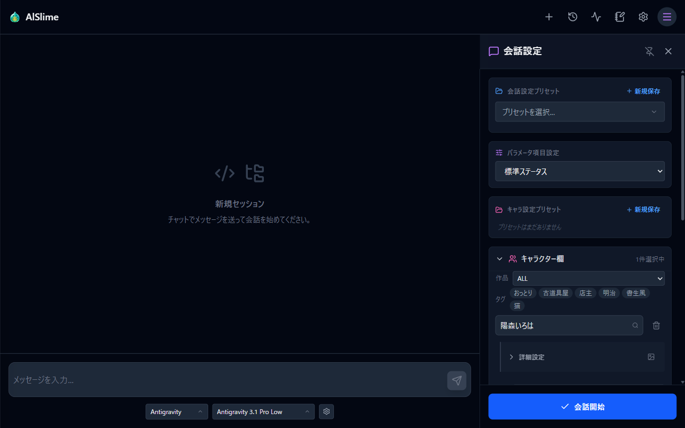
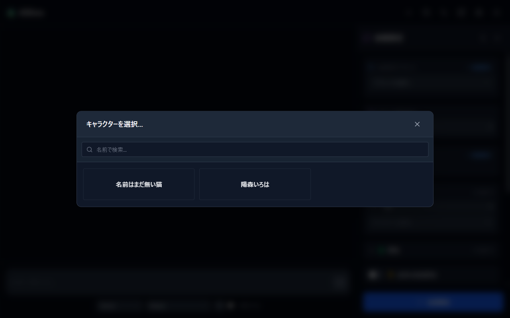
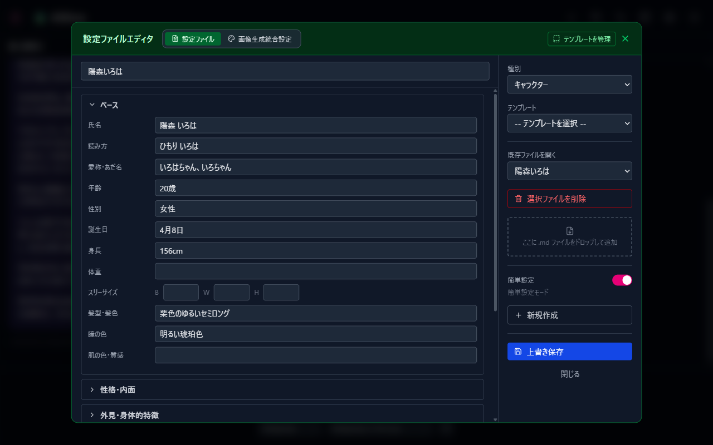
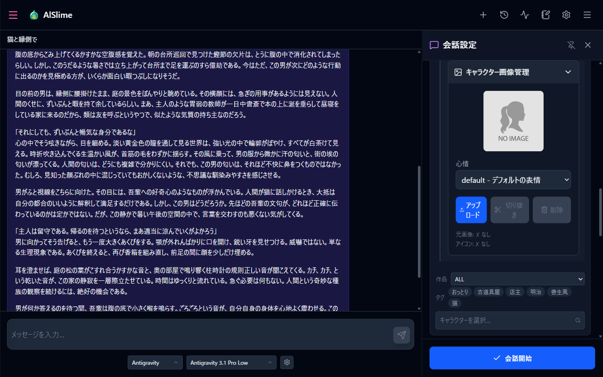
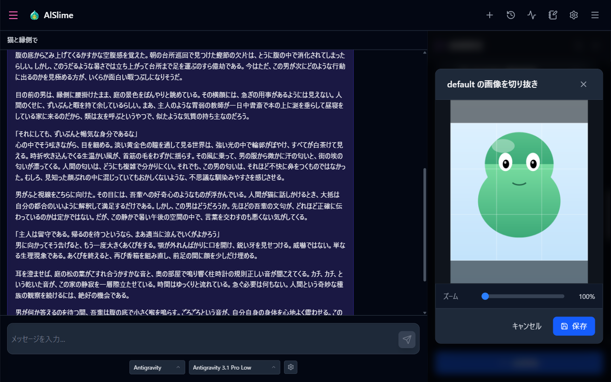
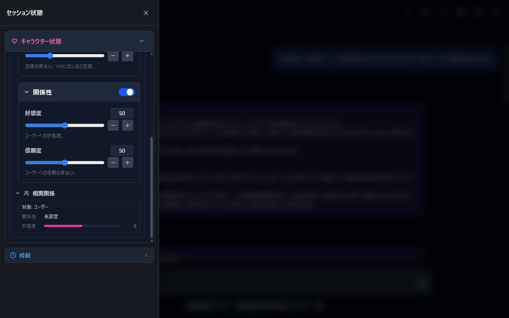

# 03 キャラクターと会話する

キャラクターを選んで会話を始める方法と、キャラクターの自作・画像設定を説明します。

## この章でやること

1. キャラクターを選んで会話を始める
2. キャラクターを自作する（簡単設定）
3. キャラクターの画像を設定する
4. 会話中のキャラクターの状態を見る

## 1. キャラクターを選んで会話を始める

1. ヘッダー右端の三本線ボタン（会話設定）を押して、右側のサイドバーを開きます。

   

2. 「キャラクター欄」の「キャラクターを選択...」を押すと、キャラクターの一覧が開きます。

   

   - 「名前で検索...」欄で絞り込めます（入力して1秒待つか、Enter で実行）。
   - サイドバーのキャラクター欄にある「作品」「タグ」のフィルタでも絞り込めます（絞り込んだ状態で一覧を開くと反映されます）。フィルタの選択肢は設定の「キャラタグマスタ更新」で再構築できます。
   - キャラクターを選ぶと枠が埋まり、下に空きの枠が増えます。**最大5人まで**同時に選べます。枠のゴミ箱ボタンでその枠を外せます。

3. 世界観・舞台・シチュエーションなどを設定したい場合は「環境」のセクションで選びます（詳しくは [04 ロールプレイ設定](04-roleplay.md)）。
4. 下部の「**会話開始**」を押すと、選んだ設定で新しい会話が始まります。あとはメッセージを送るだけです（[02 はじめての会話](02-first-chat.md)）。

> **「会話開始」と「現セッションに反映」の違い**
>
> - **会話開始**: いまの設定内容で**新しいセッション**を始めます。
> - **現セッションに反映**: 会話の途中で設定を変えたときに表示されます。新しいセッションを作らず、**いま進行中の会話に変更を適用**します。

## 2. キャラクターを自作する（簡単設定）

フォーム入力だけでキャラクターを作れます。

1. ヘッダーのノートアイコン（設定ファイルエディタ）を開きます。
2. 種別で「キャラクター」を選び、「**簡単設定**」のトグルを ON にします。

   

3. 「ベース」（氏名・読み方・愛称・年齢・性別・誕生日・身長など）を入力します。
4. 必要に応じて折りたたみ項目（性格・内面／外見・身体的特徴／服装・装飾品／口調・話し方／背景設定／能力・技術や日課等／人間関係／その他）を開いて書き足します。
5. 保存すると、入力内容はキャラクター設定ファイル（Markdown）として保存され、キャラクター一覧に現れます。

慣れてきたら「標準設定モード」に切り替えて、Markdown を直接書くこともできます（簡単設定の内容は Markdown に変換されます）。

## 3. キャラクターの画像を設定する

キャラクターに画像を登録すると、会話中のメッセージの横にアイコンとして表示されます。心情（表情）ごとに画像を分けて登録でき、会話の状況に合った表情が表示されます。

1. 会話設定サイドバーで、対象キャラクターの「詳細設定」を開きます。
2. 「**キャラクター画像管理**」のパネルを開きます。

   

3. 「心情」のプルダウンで、登録したい表情を選びます。
4. 「アップロード」で画像ファイルを選びます。
   - 対応形式: JPEG / PNG / WebP
   - サイズ上限: 5MB
5. アップロードすると、続けて切り抜き画面が開きます。ドラッグで位置を、スライダーでズーム（1〜3倍）を調整して保存します。**アイコンは正方形（1:1）で切り抜かれます。**

   

6. 登録済みの画像は、同じパネルの「切り抜き」でやり直し、「削除」で取り消せます。

## 4. 会話中のキャラクターの状態を見る

会話中は、ヘッダー左端のボタン（セッション状態）から左側のドロワーを開けます。



- **キャラクター状態**: キャラクターごとの個別設定（性格・服装・背景）の確認、パラメータや相関関係（関係性・好感度・詳細）の確認と編集ができます。編集した内容は「現セッションに反映」で会話に適用します。
- **セッション時刻**: 会話内の日付・時刻の状態を確認できます（[04 ロールプレイ設定](04-roleplay.md)）。

## 5. キャラクターのファイル構成（手動で管理したい場合）

キャラクターのデータは、起動フォルダの `roleplay/characters/` に、キャラクターごとのフォルダとして保存されます。

```text
roleplay/characters/<キャラクター名>/
├── settings/   … キャラクター設定（Markdown）
└── images/
    ├── originals/   … 心情ごとの元画像
    └── icons/       … 切り抜き後のアイコン
```

テキストエディタで設定 Markdown を直接編集したり、フォルダごとコピーしてバックアップしたりできます。

---

前章: [02 はじめての会話](02-first-chat.md) | 次章: [04 ロールプレイ設定](04-roleplay.md)
