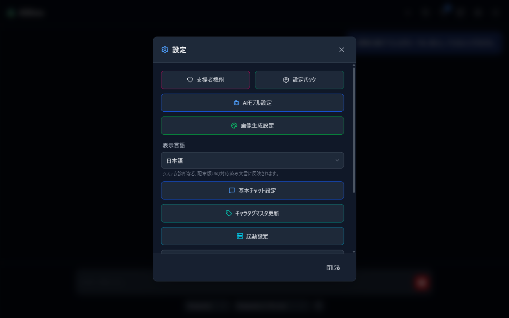
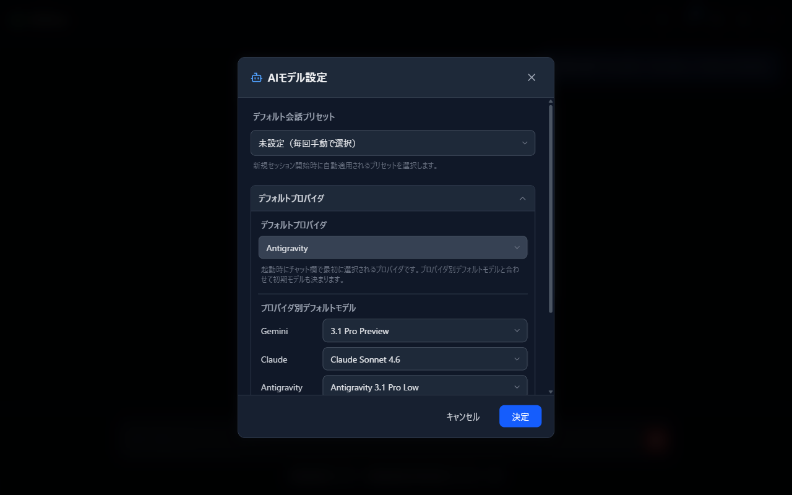
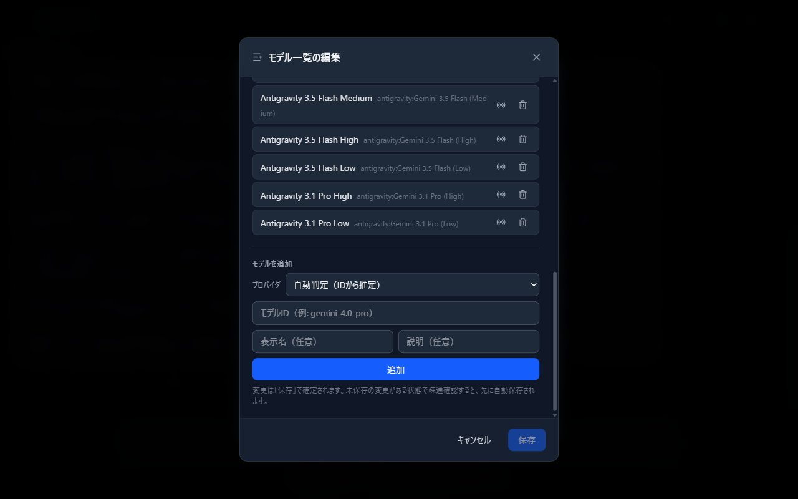
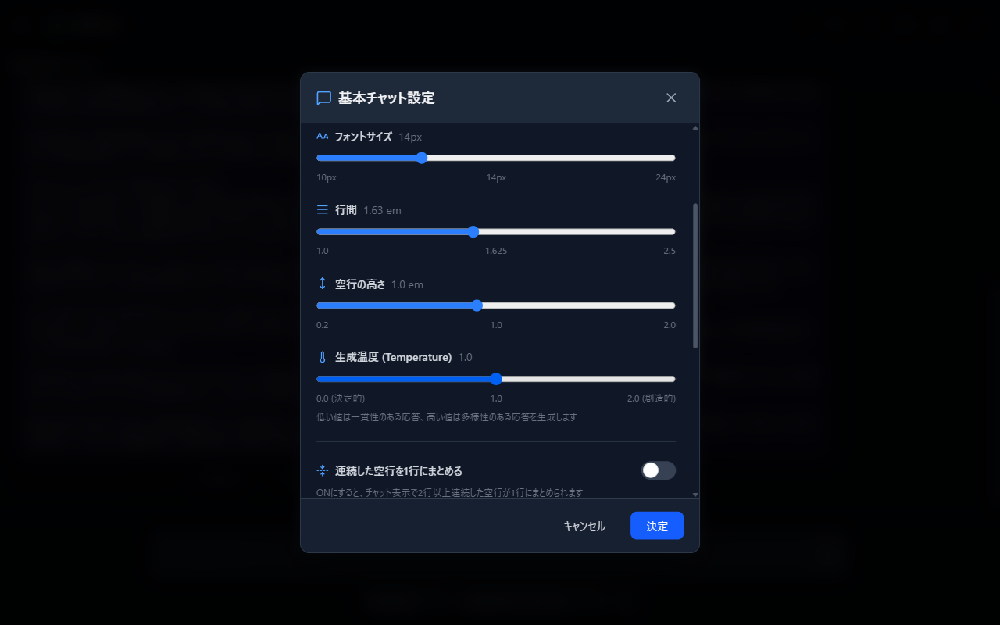
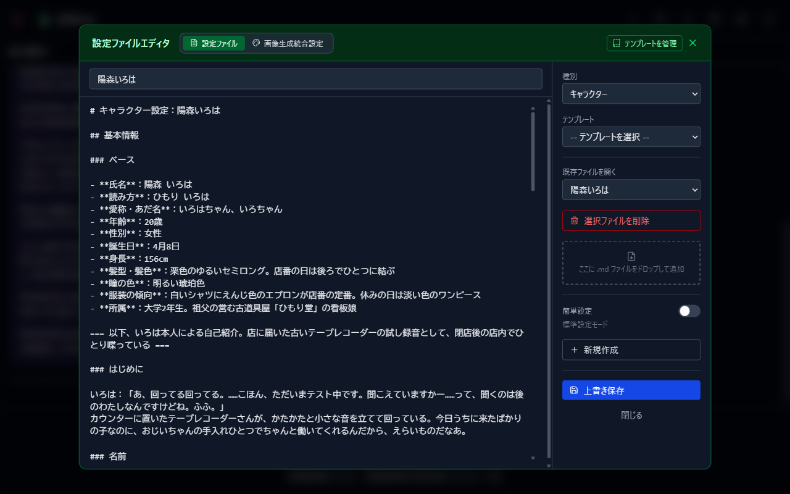
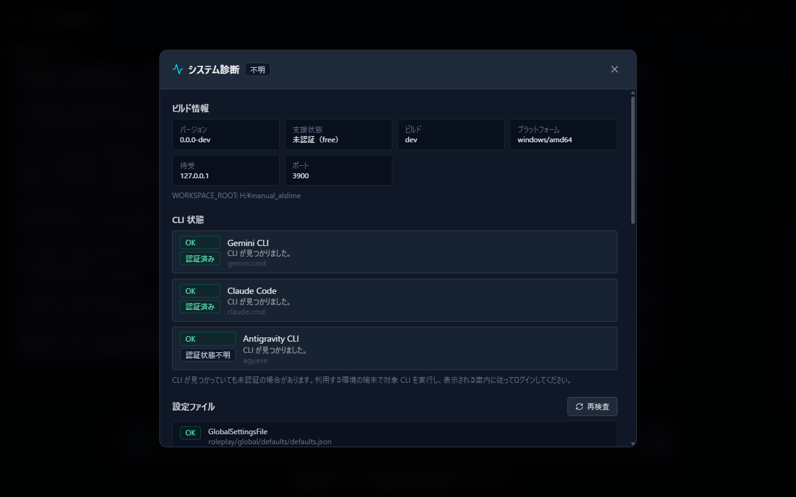

# 05 設定リファレンス

設定メニューから開ける各画面を、辞書的に引ける形でまとめます。

起動設定（ポート・CLI パス）は [01 導入とセットアップ](01-setup.md)、テキスト置換とキャラパラメータ項目は [04 ロールプレイ設定](04-roleplay.md) を参照してください。

## 1. 設定メニュー

ヘッダーの歯車アイコン（設定）で開くハブ画面です。

| ボタン | 内容 | 説明する章 |
| --- | --- | --- |
| 支援者機能 | 支援者ログインと状態確認 | [07](07-sponsor.md) |
| 設定パック | 設定のインポート / エクスポート | [06](06-settings-pack.md) |
| AIモデル設定 | 既定の会話プリセット・プロバイダ・モデル | 本章 2 |
| 画像生成設定 | ComfyUI 接続設定（**支援者機能が有効な場合のみ表示**） | [08](08-comfyui.md) |
| 表示言語 | UI 言語の切り替え（プルダウン・即保存） | 本章 1 |
| 基本チャット設定 | フォント・表示・生成温度など | 本章 4 |
| キャラタグマスタ更新 | 全キャラのタグ情報からフィルタ一覧を再構築 | 本章 1 |
| 起動設定 | ポート・待受アドレス・CLI パス | [01](01-setup.md) |
| 同時実行数管理 | AI プロセスの同時実行数上限 | 本章 6 |
| デバッグ設定 | セッションのバックアップなど開発者向け | — |
| システム診断 | 環境の自己診断（読み取り専用） | 本章 7 |

- **表示言語**: 日本語 / English。変更すると即保存されます。日本語以外にすると、祝日カレンダー機能は自動で無効になります。
- **キャラタグマスタ更新**: キャラクター選択のフィルタ（作品・タグ）の元データを、全キャラクターを走査して作り直します。フィルタの表示が実際のキャラクターと食い違ったときに押してください。

## 2. AIモデル設定

新規セッションの初期状態を決める画面です。変更は「決定」で保存されます。

- **デフォルト会話プリセット**: 新規セッション開始時に自動適用される会話設定プリセット（[04章](04-roleplay.md)）を選びます。未設定なら毎回手動選択です。
- **デフォルトプロバイダ**: 起動時にチャット欄で最初に選ばれる AI（Antigravity / Claude / Gemini）。未設定時は Gemini です。
- **プロバイダ別デフォルトモデル**: モデル未指定で送信・再生成されたときに使うモデルを、プロバイダごとに選びます。未設定なら各 CLI の既定モデルが使われます。

## 3. モデル一覧の編集

AIモデル設定内の「モデル一覧の編集」から開きます。**新しいモデルが登場したとき、アプリ本体の更新を待たずに自分でモデル ID を追加できます。**

- **一覧**: プロバイダ別に、内蔵モデルと自分で追加したモデル（「追加」バッジ）が並びます。内蔵モデルの削除は「非表示」扱いで、いつでも「復元」できます。
- **疎通確認**: 各行の電波アイコンで、そのモデル ID が実際に応答するかテストできます（応答時間と出力の冒頭が表示されます）。
- **モデルを追加**: モデル ID を入力して追加します。プロバイダは ID から自動判定され、手動指定もできます。
  - Antigravity は `antigravity:CLI内モデル表示名` の形式で入力します。
  - Gemini 系は「Thinking設定」で、ベースモデルに Thinking Level（High / Medium / Low）を適用した別名モデルを作れます。
- 変更は「保存」で確定します。未保存のまま疎通確認すると、先に自動保存されます。

## 4. 基本チャット設定

チャットの見た目と基本動作の設定です。

| 項目 | 内容 |
| --- | --- |
| デフォルトユーザー名 | 会話でのあなたの呼び名の既定値（空欄なら「ユーザー」） |
| フォント / フォントサイズ / 行間 / 空行の高さ | チャット表示の文字まわり |
| 生成温度 (Temperature) | 低いほど一貫的、高いほど多様な応答（0.0〜2.0） |
| 連続した空行を1行にまとめる | 表示上の空行を詰める |
| 祝日情報を反映 | 日本の祝日を日付時刻プロンプトへ追加（日本語 UI のときのみ表示） |
| キャラクター表示設定 | メッセージ横のキャラクター画像のサイズ（40〜500px） |

下部の「キャラパラメータ項目の管理」「テキスト置換設定」は [04章](04-roleplay.md) を参照してください。

## 5. 設定ファイルエディタ

ヘッダーのノートアイコンから開く、設定ファイル（Markdown）の編集画面です。

- **種別**: キャラクター／シチュエーション／個別性格設定／個別服装・髪型／個別背景／世界観／舞台／ユーザーの設定／職業設定／文体設定、および「AIプロバイダ指示」。
- **基本操作**: 種別を選ぶ→「既存ファイルを開く」で編集、またはタイトルと本文を書いて「新規保存」。既存ファイルは「上書き保存」、タイトルを変えると「別ファイルとして保存」も選べます。
- **AIプロバイダ指示**: 各 AI CLI が読み込む基本指示ファイルの編集専用種別です（新規作成・削除はできません）。
- `.md` ファイルをドロップして取り込むこともできます。
- キャラクター種別の「簡単設定」モードは [03章](03-character.md)、「テンプレートを管理」は [04章](04-roleplay.md) を参照してください。

## 6. 同時実行数管理

AI プロセスの同時実行数の上限を設定します。

- **全体の同時実行数**: すべての AI 種別を合計した上限。
- **種別ごとの同時実行数**: Gemini / Claude / Antigravity それぞれの上限。全体の値を下げると、種別の値も自動的に合わせて下がります。

PC の負荷が気になる場合や、複数の生成を並行させたい場合に調整してください。

## 7. システム診断

環境の自己診断結果を表示する読み取り専用の画面です。動作がおかしいときは、まずここを確認してください（[09 困ったときは](09-troubleshooting.md)）。

- **ビルド情報**: バージョン、支援状態、プラットフォーム、待受アドレス・ポート、データフォルダの場所。
- **CLI 状態**: 各 AI CLI の検出結果と認証状態。CLI が見つかっていても未認証の場合があります。
- **設定ファイル**: 破損などの検査結果。「再検査」で再実行できます。
- **キャッシュ / バックアップ**: 状態と使用容量。

## 補足: 背景画像の設定

画像付き応答を背景に表示する「セッション内背景画像」の設定は、**画像生成設定（支援者機能）の中**にあります。[08 ComfyUI 連携](08-comfyui.md) を参照してください。

---

前章: [04 ロールプレイ設定](04-roleplay.md) | 次章: [06 設定のインポート / エクスポート](06-settings-pack.md)
