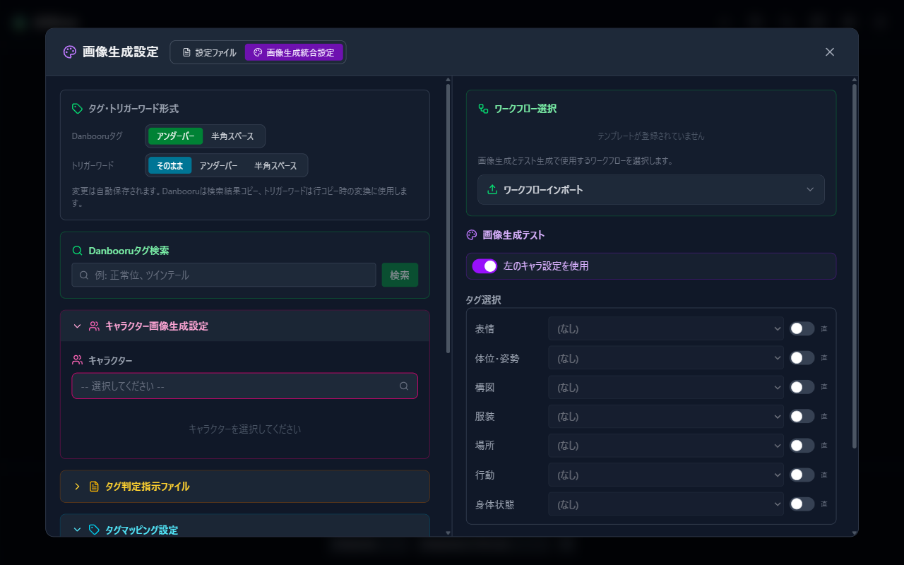

# 画像生成設定の詳細

公式サンプルで画像を生成できたあと、キャラクターの見た目や場面ごとの仕上がりを整えたいときにご覧ください。

## タグ判定の形式を選ぶ

「画像生成設定」→「タグ判定プロンプト設定」では、次の形式を選べます。

- **Danbooruタグのみ**：タグを中心に扱うワークフローに向いています。
- **自然言語混在（Anima等向け）**：人物同士の位置関係などを、短い文章でも受け取れるワークフローに向いています。

「Danbooruタグ取得形式」にある「アンダーバー」「半角スペース」は、検索結果をコピーするときの表記を選ぶ設定です。「タグ判定プロンプト形式」とは別にお選びいただけます。

## キャラクターの見た目を整える

「キャラクター画像生成設定」では、次の内容を登録できます。

- キャラクター名と作品名
- 会話で使われる別名
- 髪型や目の色などの身体的特徴
- キャラクター LoRA
- 衣装ごとのプロンプトと LoRA
- 常に加えたいポジティブプロンプトとネガティブプロンプト

「Danbooruタグ検索」では、日本語でタグを検索できます。ComfyUI 側へ新しい LoRA を追加したあと、一覧に表示されない場合は「再読込」をお試しください。

## 場面ごとの設定を作る

「タグマッピング設定」では、表情、姿勢、構図、場所、行動などに合わせて、プロンプトや LoRA を切り替えられます。

- **照合キー**には、設定を見分ける名前を入力します。
- **AI への説明**には、その設定を使いたい場面を記します。
- **danbooru語（プロンプト）**には、画像へ加えたい内容を入力します。
- 必要に応じて、ネガティブプロンプト、LoRA、優先ワークフローも選べます。

似た場面の設定を複数作る場合は、それぞれを見分けやすい照合キーにしておくと選びやすくなります。

## 共通の内容をまとめる

「プレースホルダプリセット」では、品質や画風など、複数のワークフローで使いたい内容をまとめておけます。

1. 「変換元」に、ワークフローへ記した置換文字列の名前を入力します。
2. 「変換先」に、画像へ加えたい内容を入力します。
3. 場面によって使い分ける場合は、「AI への説明」も添えます。
4. 保存したあと、「画像生成テスト」の「プレースホルダ変換」で使用するプリセットを選びます。

独自の置換文字列をワークフローへ加える方法は、[独自ワークフローを用意する](09-comfyui-custom-workflow.md)でご案内しています。

## タグ判定指示を調整する

タグ判定指示ファイルは、会話のどこを読み、どのような内容を画像へ反映するかを AI に伝えるためのものです。

公式サンプルをお使いの場合は、初めから用意されている内容のままお試しいただけます。独自に調整する場合は、「画像生成設定」の「タグ判定指示ファイル」から編集できます。

## 統合設定を使う

画面幅にゆとりのある環境では、「画像生成設定」で、キャラクター設定、タグマッピング、タグ判定指示、テスト生成を一つの画面で扱えます。

左側の設定を保存してから、右側の「画像生成テスト」で仕上がりをお確かめください。

---

[09 ComfyUI 連携へ戻る](09-comfyui.md)
