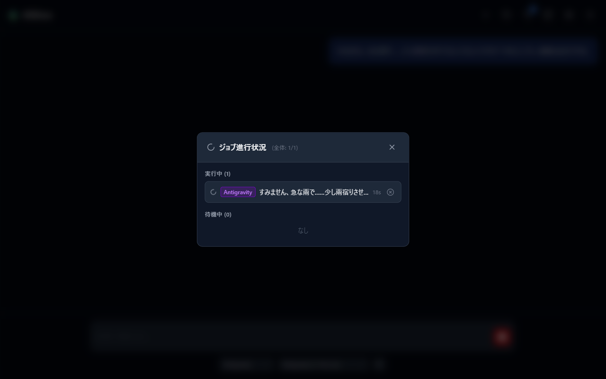

# 09 困ったときは

よくあるトラブルの調べ方と対処をまとめます。

## 1. まずはシステム診断

設定（歯車）→「システム診断」で、環境の自己診断結果を確認できます（[05章 7節](05-settings.md)）。

- **CLI 状態**: AI CLI が見つかっているか、認証済みかが一目で分かります。
- **設定ファイル**: 破損ファイルの検出。「再検査」で再確認できます。
- **ビルド情報**: ポート・データフォルダの場所・支援状態の確認。

## 2. 起動しない・画面が出ない

- **ブラウザが開かない**: コンソールに表示されるアドレス（通常 `http://127.0.0.1:3000`）を直接開いてください。
- **起動直後に終了してしまう**: ポートが他のアプリと衝突している可能性があります。別のポートを指定して起動してみてください（[01章 6節](01-setup.md)）。
- **画面が古い・表示が崩れる**: ブラウザの再読み込み（更新ボタン）を試してください。

## 3. メッセージを送っても応答が返らない

エラーはチャット内に「エラー: ...」として表示されます。代表的なものと対処です。

| エラー | 対処 |
| --- | --- |
| CLI が見つかりません。該当 CLI をインストールし、必要に応じて端末でログインしてください。 | 使いたい AI CLI を導入してください。導入済みなら [01章 5節](01-setup.md) で実行ファイルの場所を指定します |
| 設定された CLI パスが見つかりません。 | 起動設定の CLI パスの入力ミスを確認してください。空欄に戻すと PATH から自動探索します |
| Gemini CLI が未認証です。端末で gemini を実行し、ログインしてください。 | 表示のとおり、その CLI をターミナルで一度起動してログインを済ませてください（Claude Code / Antigravity も同様のメッセージが出ます） |
| エラー: タイムアウトしました（10分間応答なし） | 回線や AI サービス側の混雑の可能性があります。もう一度送信するか、モデルを変えて試してください |

- **送信が反応しない**: 送信は **Shift+Enter** です（Enter は改行。[02章](02-first-chat.md)）。
- **応答が遅い**: 応答は完成後にまとめて表示されるため、内容によっては数分かかります。待っている間は停止ボタンで中止できます。

## 4. 実行中の処理を確認・中止する

ヘッダーの「ジョブ進行状況」（波形アイコン。実行中の件数がバッジ表示されます）で、実行中・待機中の処理の一覧を確認できます。

- 実行中のジョブは「中止」、待機中のジョブは「キャンセル」できます。
- 直近のエラーも下部に表示されます。
- 同時に実行できる数は設定（歯車）→「同時実行数管理」で調整できます（[05章 6節](05-settings.md)）。

## 5. 画像生成がうまくいかない（支援者向け）

- 「この機能は支援者向けです。現在の支援状態では利用できません。」: [07章](07-sponsor.md) で支援状態を確認してください。
- 「接続テストに失敗しました」「接続先URLが指定されていません。」: ComfyUI 本体の起動と接続 URL を確認してください（[08章](08-comfyui.md)）。
- 「画像タグ判定に失敗しました。」: タグ判定 AI（分析 AI）の CLI が使える状態か、本章 3 節の CLI エラーと同じ観点で確認してください。

## 6. 設定が反映されない

- **ポート・待受アドレス・LAN公開**: 変更は次回起動時に反映されます。アプリを再起動してください。
- **会話設定（キャラ・環境など）の変更**: 進行中の会話には自動反映されません。サイドバー下部の「現セッションに反映」を押してください（[03章](03-character.md)）。
- **モジュールを配置したのに機能が出ない**: モジュールは配置後、**アプリの再起動**で有効になります（[07章](07-sponsor.md)）。

## 7. データの場所とバックアップ

会話履歴・設定・キャラクターはすべて起動フォルダの `roleplay/` 配下にあります。フォルダごとコピーすればバックアップになります。設定類だけを持ち運ぶなら[設定パック](06-settings-pack.md)が便利です。

## 8. 解決しないときは

[GitHub の Issue](https://github.com/Yaki-Mikan/alslime/issues) でお知らせください。その際、システム診断の表示内容（個人情報が写らない範囲で）を添えていただくと調査がはかどります。

---

前章: [08 ComfyUI 連携](08-comfyui.md) | 目次に戻る: [index](../index.md)
