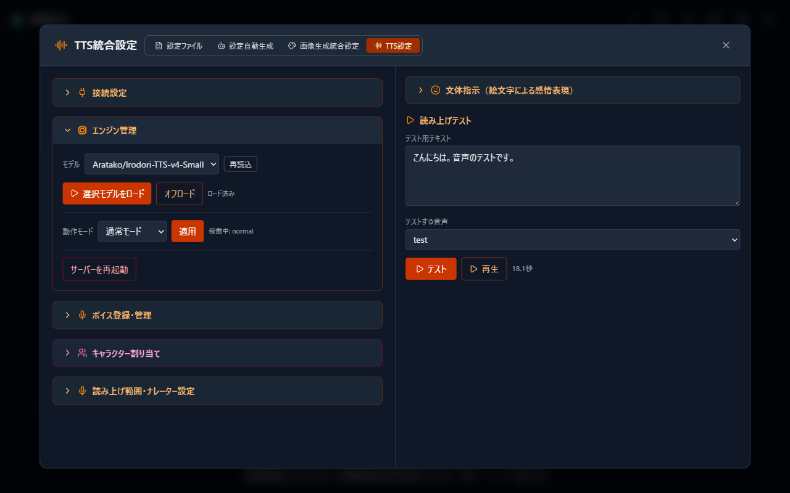
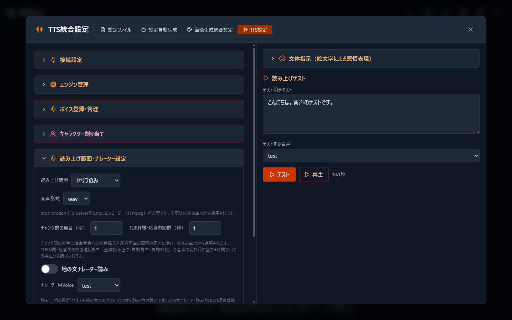

# 10 音声読み上げ 設定項目の詳細

[目次に戻る](../index.md) | [10 音声読み上げへ戻る](10-tts.md)

「TTS設定」の各項目と、チャット画面左メニューの音声読み上げパネルをご案内します。

開き方: 設定ファイルエディタ →「TTS設定」タブ。設定（歯車）→「TTS設定」からも開けます。

## 接続設定

Irodori-TTS-Server への接続をまとめた欄です。

| 項目 | 内容 |
| --- | --- |
| エンドポイントURL | Irodori-TTS-Server の接続先。初期値は `http://127.0.0.1:8088` です。別 PC 上のサーバーも指定できます |
| APIキー（リモート接続時のみ） | 別 PC のサーバーへ API キー付きで接続する場合に入力します。設定済みの場合は「設定済み（変更する場合のみ入力）」と表示され、変更するときだけ入力し直します |
| 接続タイムアウト（秒） | 接続確認などの待ち時間です。通常は変更不要です |

「接続を確認」を選ぶと、次の 3 点を順に確かめます。

- **サーバー応答**: サーバーが応答しているか
- **モデル一覧**: モデルの情報を取得できるか
- **Voice一覧**: 登録ボイスの一覧を取得できるか

あわせて、モデル名・モデル状態（未ロード / ロード中 / ロード済み）・登録Voice数が表示されます。「モデル状態: 未ロード」は異常ではありません。モデルは最初の生成時に自動で読み込まれます。

## エンジン管理

Irodori-TTS-Server のモデルと動作モードを AlSlime から操作できる欄です。**フォーク版サーバーに接続しているときだけ使えます。**

| 項目 | 内容 |
| --- | --- |
| モデル | 使用するモデルを選びます。「選択モデルをロード」で事前に読み込み、「オフロード」でメモリから解放します |
| 動作モード | 通常モードと省メモリモードを切り替えられます。「適用」で反映し、現在の状態は「稼働中」に表示されます |
| サーバーを再起動 | Irodori-TTS-Server を再起動します。実行中の音声生成は中断されるため、確認のうえ実行してください |

省メモリモードは、VRAM の少ない環境や、画像生成と同時に使う場合の調整にご利用いただけます。動作モードの変更は、反映にサーバーの再起動が必要な場合があります。画面の案内に従ってください。

公式版サーバーに接続している場合は、「接続中のサーバーはエンジン管理API（runtime系）に対応していません。」と表示されます。

## 読み上げ範囲・ナレーター設定

読み上げの対象と、再生のしかたをまとめた欄です。変更は即時保存されます。

| 項目 | 内容 |
| --- | --- |
| 読み上げ範囲 | 「セリフのみ」か「セリフ＋地の文」を選びます |
| 音声形式 | wav（既定）か mp3。mp3 は Irodori-TTS-Server 側に mp3 エンコーダー（FFmpeg）が必要です。変更は以後の生成から適用されます |
| チャンク間の無音（秒） | 長い文を分けて生成した際の、つなぎ目の無音です。結合音声への無音挿入と、逐次再生の間隔の両方に使われます |
| TURN間・応答間の間（秒） | とおし再生で、発言の切れ目に空ける時間です。次の再生から適用されます |
| 地の文ナレーター読み | 読み上げ範囲が「セリフ＋地の文」のとき、地の文をナレーター用の声で読むかどうかです |
| ナレーター用Voice | 地の文を読み上げる声です。未設定の場合は、その発言のキャラクターの声で読み上げます |
| 続きを自動再生 | とおし再生で、応答の区切りを超えて、生成済みの次の音声を続けて再生します |
| 再生音量 | 読み上げ音声の再生音量です |

## 文体指示（絵文字による感情表現）

「Irodori-TTS用文体指示」を有効にすると、AI が対応絵文字を文へ添えて応答し、読み上げ音声へ感情が乗ります。絵文字は画面表示と画像生成では常に取り除かれ、音声生成にだけ使われます。変更は即時保存されます。

### 仕組み

- 絵文字は音声合成エンジンへの演技指示として働きます。絵文字そのものは発音されません。
- 絵文字を置くと、直後に続く文の読み上げへ、その絵文字の感情・調子が作用します。

### 対応絵文字一覧

| 分類 | 絵文字と意味 |
| --- | --- |
| 息・声の質 | 👂 囁き声 / 😮‍💨 吐息・溜息・寝息 / 😮 息をのむ / 🌬️ 息切れ・荒い息遣い / 🥱 あくび |
| 音響効果 | ⏸️ 間・沈黙 / 📢 エコー・リバーブ / 📞 電話越しの声 |
| 笑い・喜び | 🤭 笑い / 😆 喜びながら / 😊 楽しげに・嬉しそうに |
| 悲しみ・苦しみ | 😭 嗚咽・泣き声 / 😱 悲鳴・叫び / 😠 怒り・不満げに / 😖 苦しげに |
| 感情・態度 | 😏 からかうように・甘えるように / 🥺 声を震わせながら・自信なさげに / 🥵 喘ぎ・うめき声 / 🫶 優しく / 😪 眠そうに / 😴 寝言・いびき / 😰 慌てて・動揺・緊張 / 😲 驚き・感嘆 / 🫣 恥ずかしそうに / 🙄 呆れたように / 😎 得意げに・自信ありげに / 😌 安堵・満足げに / 🤔 疑問の声 / 😟 心配そうに |
| 話す速さ | ⏩ 早口・急いで / 🐢 ゆっくりと |
| 口の音 | 👅 舐める音・咀嚼音・水音 / 💋 リップノイズ / 🥤 唾を飲み込む音 / 😒 舌打ち / 🤧 咳き込み・鼻をすする・くしゃみ |
| その他 | 👌 相槌・頷く音 / 💥 勢いよく・勢いに任せて / 🙏 懇願するように / 🥴 酔っ払って / 🎵 鼻歌 / 🤐 口を塞がれて / 💪 力を込めて・力強く / 👃 匂いを嗅ぐ音 / 📖 ナレーション・独白 |

## 左メニューの音声読み上げパネル

チャット画面左上のメニューから開けるパネルです。表示言語が日本語のときに表示されます。よく使う項目を会話しながら調整できます。

| 項目 | 内容 |
| --- | --- |
| 読み上げ範囲・音声形式・チャンク間の無音 | 「TTS設定」と同じ値を読み書きします |
| 自動読み上げ | 新しい応答が届くたびに自動で音声を生成します |
| 応答時に音声も再生する | 自動読み上げで生成した音声を、届いたその場で再生まで行います |
| 再生停止ボタンを表示 | 再生を止めるボタンを画面に表示します |
| 続きを自動再生・再生音量 | 「TTS設定」と同じ値を読み書きします |
| 地の文ナレーター読み・ナレーター用Voice | 「TTS設定」と同じ値を読み書きします |
| Irodori-TTS用文体指示 | 「TTS設定」と同じ値を読み書きします |

## フォーク版と公式版の違い

| 機能 | フォーク版 | 公式版 |
| --- | --- | --- |
| 音声の生成・再生 | ○ | ○ |
| 日本語の Voice ID | ○ | ×（半角英数・ハイフン・アンダースコアのみ） |
| Latent ファイルの直接登録 | ○ | ×（「生成してダウンロード」は利用できます） |
| エンジン管理（モデル切替・省メモリ・再起動） | ○ | × |

どちらに接続しているかは AlSlime が自動で判定し、使えない機能には画面上で案内が表示されます。

---

[10 音声読み上げへ戻る](10-tts.md) | [目次に戻る](../index.md)
