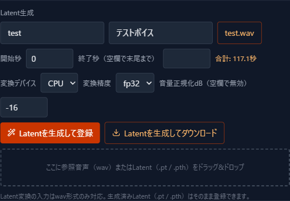
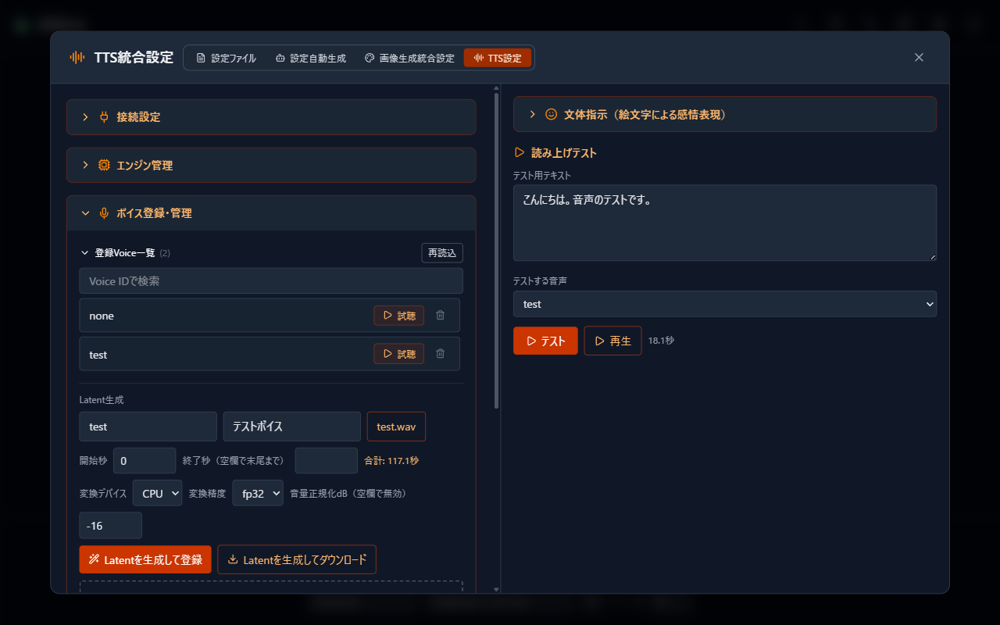
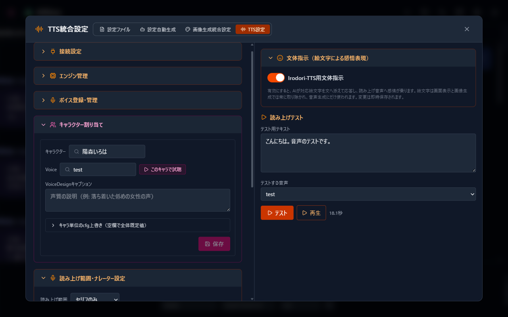

# 10 音声読み上げ ボイスを作成する

[目次に戻る](../index.md) | [10 音声読み上げへ戻る](10-tts.md)

参照音声から声を作り、キャラクターへ割り当てるまでをご案内します。

> **ご注意**
>
> 参照音声には、ご自身に権利があるか、利用を許諾された音声をお使いください。本人の同意のない音声クローンや、なりすまし・ディープフェイクへの使用は禁止されています。

## 声を用意する 2 つの方法

- **参照音声から作る**: お手元の音声ファイルから声質を写し取った「Latent」を作り、ボイスとして登録します。
- **VoiceDesign で言葉から設計する**: ボイスを登録せず、キャラクターへ「VoiceDesign キャプション」を設定して、文章で声質を指定します。

両方を組み合わせることもできます。参照音声で土台の声を決め、キャプションで話し方を添える、といった使い方です。

## 参照音声を準備する

- 対応形式: wav / flac / mp3 / m4a / ogg / opus / aac / webm
- 参照音声は v4-Small で合計 120 秒までです
- 雑音の少ない、声だけの音声ほど仕上がりが安定します

## Latent 生成で登録する

開き方: 「TTS設定」→「ボイス登録・管理」→「Latent生成」。

1. 「Voice ID」を入力します。フォーク版サーバーなら日本語の ID も使えます。
2. 「表示名」を入力します。
3. 「ファイルを選択」で参照音声を選びます。ドラッグ＆ドロップでもかまいません。
4. 「Latentを生成して登録」を選びます。

生成には少し時間がかかります。完了すると「登録Voice一覧」へ追加され、試聴できます。

そのほかの項目は、必要に応じてお使いください。

| 項目 | 内容 |
| --- | --- |
| 開始秒・終了秒 | 参照音声のうち、使用する範囲を指定します。終了秒が空欄なら末尾までです。選択中の合計秒数が表示されます |
| 変換デバイス・変換精度 | Latent 変換に使う計算環境です。通常は初期値のままでかまいません |
| 音量正規化dB | 参照音声の音量を整えます。空欄で無効です |
| Latentを生成してダウンロード | 登録せず、Latent ファイル（.pt）として保存します。控えを残したいときにお使いください |

Latent 変換の入力は wav 形式のみ対応です。ほかの形式の参照音声は、次の「直接アップロード」をお使いください。

## 参照音声・Latent を直接アップロードする

開き方: 「TTS設定」→「ボイス登録・管理」→「参照音声・Latentの直接アップロード」。

参照音声（対応形式すべて）や、生成済みの Latent ファイル（.pt / .pth）を、Voice ID を付けてそのまま登録できます。Latent の直接登録はフォーク版サーバーでご利用いただけます。

## VoiceDesign キャプションの書き方

キャラクターへ、声質を文章で指定できます。例:

- 落ち着いた低めの女性の声
- 明るく元気な少女の声。早口ぎみ
- 穏やかな年配の男性の声で、ゆっくりと話す

参照音声のボイスと併用した場合は、ボイスの声質へキャプションの指示が加わります。

## キャラクターに割り当てる

開き方: 「TTS設定」→「キャラクター割り当て」。会話設定サイドバーのキャラクター枠にある音声設定アイコンからも開けます。

| 項目 | 内容 |
| --- | --- |
| キャラクター | 割り当てるキャラクターを選びます |
| Voice | 登録済みボイスから選びます |
| このキャラで試聴 | いまの割り当て内容で、ひとこと試聴します |
| VoiceDesignキャプション | 声質の指定を文章で添えます |
| キャラ単位のcfg上書き | 生成パラメータをこのキャラクターだけ変えたい場合に開きます。空欄なら全体の既定値が使われます |

設定を変えたら「保存」を選びます。

## 試聴と削除

「登録Voice一覧」では、各ボイスの試聴と削除ができます。削除の際は、そのボイスを使用中のキャラクターが表示されるので、確かめてから削除してください。

---

[10 音声読み上げへ戻る](10-tts.md) | [目次に戻る](../index.md)
